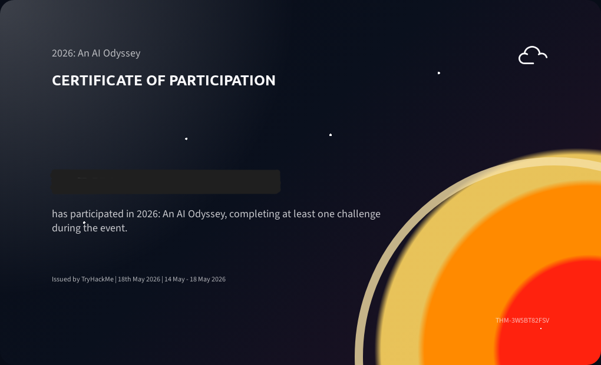

# TryHackMe 2026: An AI Odyssey CTF

This CTF was run by TryHackMe from May 14th-17th 2026.
The event was focused on AI challenges, ranging from prompt injection, data poisoning, agentic AI, etc.
The event link can be found [here](https://tryhackme.com/module/2026anaiodysseyrj20j).

I was able to solve challenges in the [Vectara](https://tryhackme.com/room/vectara) and [Token City](https://tryhackme.com/room/tokencity) rooms.

All flags have the format: **THM{flag_goes_here}**

