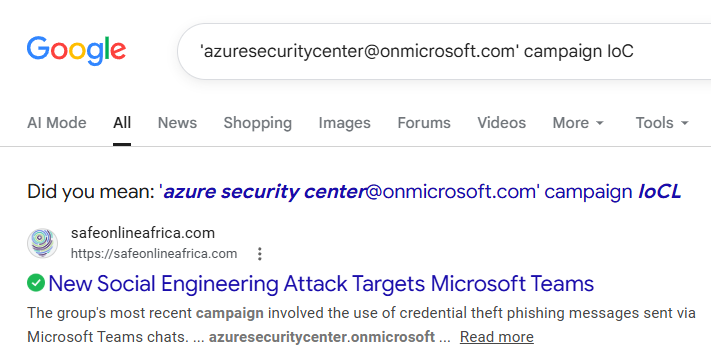

# OSINT - The Azure Deception

## Description
Shortly after the Door Without Handles began moving, someone sent Brynn a taunting message through the council's communication channels. It appeared to come from Microsoft's own security team—the address read azuresecuritycenter@onmicrosoft.com—but the words dripped with mockery:

`"It looks like you fell for it… Again. Not every onmicrosoft.com is official ;)".` 

The domain seemed legitimate at first—onmicrosoft.com is genuine Microsoft territory—yet Brynn knows deception when she sees it. Someone is wearing a trusted mask. She must investigate this exact address through shadow-intelligence archives, identify which ghost organization has weaponized this Microsoft domain in past hauntings, and determine which named operation previously used this specific false identity to breach their victims. 

Even the most official-looking doors can lead to hollowed places.Flag Format: HTB{Operation_Name} Example (Fictional): HTB{Operation_Midnight} Important: Use underscore _ between words Capitalize first letter of each word Include "Operation" if it's part of the name

**Skills learned:**
* Threat Intelligence

## Finding the Flag

I started researching online for IoCs related to this phishing campaign. The exact phrase I used was `'azuresecuritycenter@onmicrosoft.com' campaign IoC`. 

Opening the link [shown above](https://safeonlineafrica.com/new-social-engineering-attack-targets-microsoft-teams/) attributes this campaign to Midnight Blizzard's (AKA Cozy Bear, APT29) most recent campaign and confirms an indicator of compromise is the domain name **azuresecuritycenter.onmicrosoft[.]com**.

Pivoting now to search the campaigns attributed to this group documented by [MITRE](https://attack.mitre.org/groups/G0016/) we see two findings: 
* C0023 - Operation Ghost
* C0024 - SolarWinds Compromise

We can confirm that the campaign alluded to here is **Operation Ghost** by going back to our internet search and investigating other search results. 

SOCRadar's [search result](https://socradar.io/blog/apt-profile-cozy-bear-apt29/) also lists Operation Ghost.

**Answer: HTB{Operation_Ghost}**
