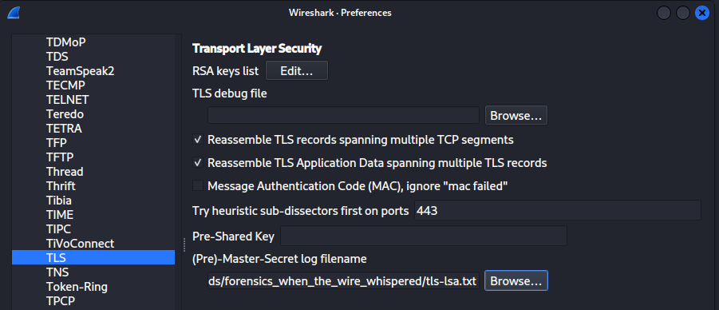
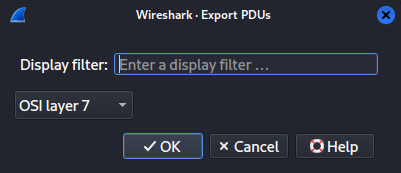
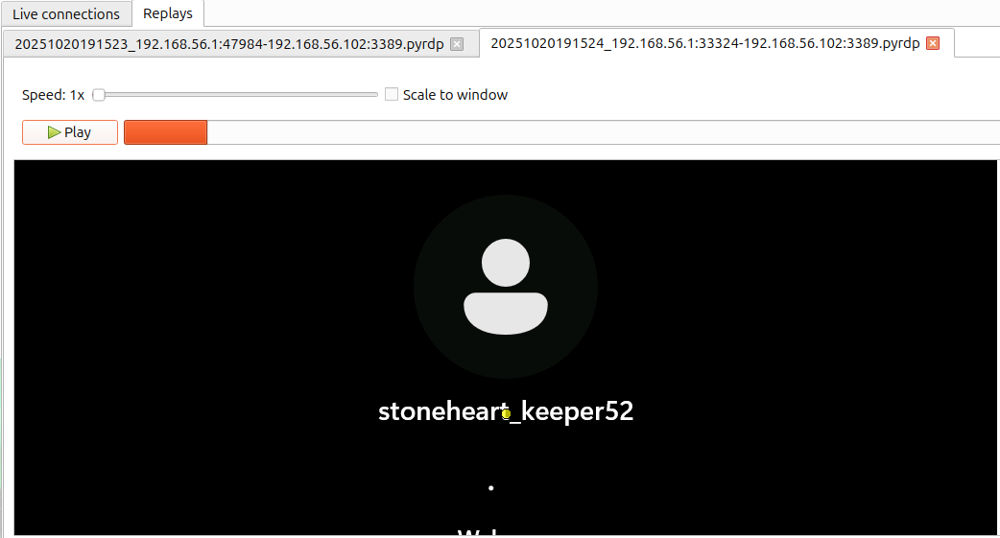
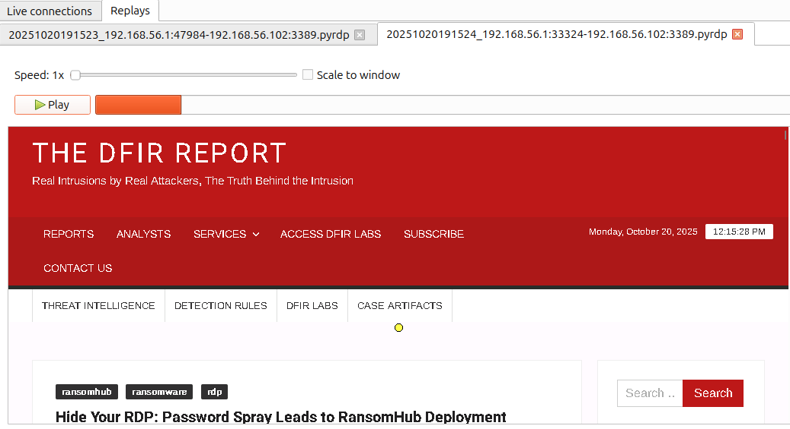
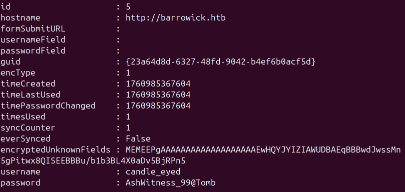

# Forensics - When The Wire Whispered

## Description
Brynn’s night-threads flared as connections vanished and reappeared in reverse, each route bending back like a reflection misremembered. The capture showed silent gaps between fevered bursts—packets echoing out of sequence, jittering like whispers behind glass. Eira and Cordelia now sift the capture, tracing the pattern’s cadence to learn whether it’s mere corruption… or the Hollow King learning to speak through the wire. <br>
**Note: Make sure you are using Wireshark v4.6.0+** <br>
**Note2: Use PyRDP *git* version**

**Skills learned:**
* Network traffic decryption & analysis
* PyRDP MiTM 

**File attachment(s):**
```text
forensics_when_the_wire_whispered.zip
├── capture.pcap
├── PASSWORDS.txt
├── tls-rsa.log
└── USERS.txt
```

## Additional Setup Required
### Tool installation
I completed this invesigaiton on an Ubuntu 24.04.3 LTS machine.
As mentioned in the notes above, we need to ensure our version of Wireshark is at least 4.6.0. Update and/or install Wireshark to match this requirement.

We are also instructed to use the **git** version of the tool [PyRDP](https://github.com/GoSecure/pyrdp). I installed PyRDP inside a virtual environment using these commands: (along with installing the av package before pyrdp)
```
python3 -m venv [ENV NAME]
source [ENV NAME]/bin/activate

sudo apt install python3 python3-pip python3-venv \
        build-essential python3-dev git openssl
python3 -m pip install pipx
python3 -m pipx ensurepath
python3 -m pip install pipx

sudo apt install -y python3-dev pkg-config
sudo apt install -y libavformat-dev libavcodec-dev libavdevice-dev libavutil-dev libswscale-dev libswresample-dev libavfilter-dev
pip install av

pipx install pyrdp-mitm[full]
```

My Ubuntu machine also required the PySide6 package to be installed to use the GUI for pyrdp-player: `pip install PySide6`

### Traffic decryption
Opening the network capture file, we can see that the traffic is encrpyted. We must first decrypt the TLS traffic - I did so following this [guide](https://packetsafari.com/blog/2022/10/07/wireshark-decryption/).

Since we have already been given a key log file in tls-rsa.log, we can use this in place of SSKEYLOGFILE. I renamed tls-rsa.log to **tls-rsa.txt** before continuing.

Then I opened the Wireshark **Preferences > Protocols > TLS** and added the tls-rsa.txt as the **(Pre)-Master-Secret log filename** and **Apply** the new setting.



### Extracting the RDP traffic
I found this useful [guide](https://haxor.no/en/article/analyzing-captured-rdp-sessions) to extract only the RDP traffic out of our pcap file.

Click **File > Export PDUs to File** then change **DLT User** to **OSI Layer 7**.



Now that Wireshark displays only the Layer 7 traffic, we can save this to a new, separate capture using **File > Save As**.

### Converting PCAP to PyRDP

Run the **pyrdp-convert** tool to convert the layer 7 traffic capture file into a .pyrdp file. Example output can be seen below:

```
pyrdp-convert layer7.pcap 
[*] Analyzing PCAP 'layer7.pcap' ...
    - 0.20.0.4:1638404 -> 0.21.0.4:1703940 : plaintext
    - 192.168.56.1:57392 -> 192.168.56.102:3389 : plaintext
    - 192.168.56.1:57630 -> 192.168.56.102:3389 : plaintext
    - 192.168.56.1:57638 -> 192.168.56.102:3389 : plaintext
    - 192.168.56.1:57644 -> 192.168.56.102:3389 : plaintext
    - 192.168.56.1:57646 -> 192.168.56.102:3389 : plaintext
    
...

[*] Processing 0.20.0.4:1638404 -> 0.21.0.4:1703940
100% (2286 of 2286) |####################| Elapsed Time: 0:00:00 Time:  0:00:00

[+] Successfully wrote '20251020191402_0.20.0.4:1638404-0.21.0.4:1703940.pyrdp'
[*] Processing 192.168.56.1:57392 -> 192.168.56.102:3389
100% (4 of 4) |##########################| Elapsed Time: 0:00:00 Time:  0:00:00
```

We see two new .pyrdp files have been created:
* 20251020191523_192.168.56.1:47984-192.168.56.102:3389.pyrdp
* 20251020191524_192.168.56.1:33324-192.168.56.102:3389.pyrdp

Play both of these files using the GUI: `pyrdp-player-gui 20251020191523_192.168.56.1\:47984-192.168.56.102\:3389.pyrdp 20251020191524_192.168.56.1\:33324-192.168.56.102\:3389.pyrdp`

Play both of these files using headless mode: `pyrdp-player 20251020191523_192.168.56.1\:47984-192.168.56.102\:3389.pyrdp 20251020191524_192.168.56.1\:33324-192.168.56.102\:3389.pyrdp --headless`

## Questions

1. What is the username affected by the spray?

We can see the affected username by playing the RDP session with PyRDP GUI:



**Answer: stoneheart_keeper52**

---

2. What is the password for that username?

I used this [video guide](https://www.youtube.com/watch?v=mu7-naA0muc) to extract NTLM hash values from our packet capture file.

The hash is:
```
STONEHEART_KEEPER52::DESKTOP-6NMJS1R:07dafdc52137fdfd:1b57385e9ea50fb8979930f8e3cca671:0101000000000000802b7ce2f541dc01c21fb4a9bd8acaff0000000002001e004400450053004b0054004f0050002d0036004e004d004a0053003100520001001e004400450053004b0054004f0050002d0036004e004d004a0053003100520004001e004400450053004b0054004f0050002d0036004e004d004a0053003100520003001e004400450053004b0054004f0050002d0036004e004d004a0053003100520007000800c85187e2f541dc0109004e007400650072006d007300720076002f004400450053004b0054004f0050002d0036004e004d004a0053003100520040004400450053004b0054004f0050002d0036004e004d004a005300310052000000000000000000
```

Using hashcat to crack this hash against the list of possible passwords in PASSWORDS.txt: `hashcat -a 0 -m 5600 hash.txt PASSWORDS.txt`
which cracks the hash to: Mlamp!J1

**Answer: Mlamp!J1**

---

3. What is the website the victim is currently browsing? (TLD only: google.com)

Continuing to play the file **20251020191524** with the PyRDP GUI we can see the website being browsed.



**Answer: thedfirreport.com**

---

4. What is the username:password combination for website `http://barrowick.htb`?

We can see CLIPBOARD DATA from the **pyrdp-player** headless mode output. Scrolling to see data related to the domain `barrowick.htb` shows:



Or by playing the entire RDP session using pyrdp-player-gui we can see the attacker launched a PowerShell script to extract Firefox passwords. They can be seen in the GUI window, just as they appear in the headless mode output.

**Answer: candle_eyed:AshWitness_99@Tomb**
