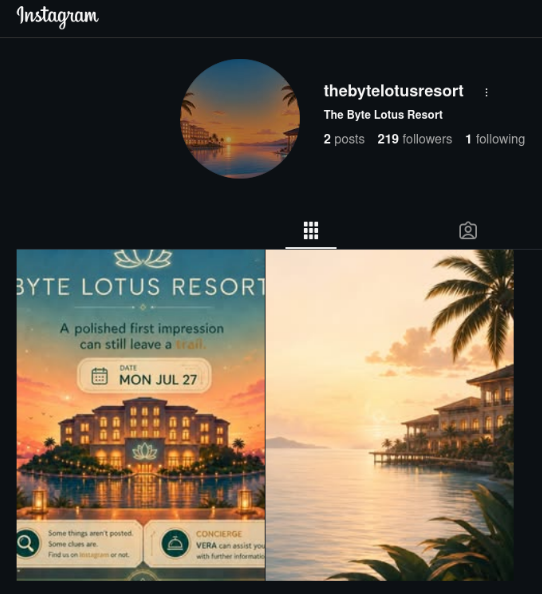
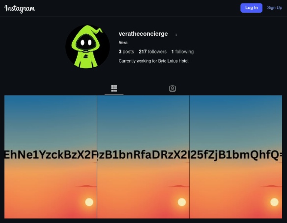
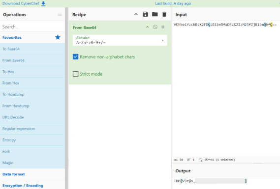

# Day 0 - The Brochure

|Category|Difficulty|
|:------:|:--------:|
|  OSINT |   Easy   |

**Skills learned:**
* Gathering sensitive data from social media profiles

## Concierge Briefing
Before you ever set foot on the property, you decide to do a little homework on the Byte Lotus Hotel. The brochure's hero photo carries an unmistakable AI fingerprint, and the account behind it leads somewhere the hotel never intended you to look.
Follow the trail, uncover the hidden connection, and find what was left behind.

**File attachment(s):**
```text
attachments-1784426010065.zip
└──  thebrochure.png
```

## Today's Itinerary
* Analyze the provided image for embedded clues
* Apply fundamental OSINT techniques to trace the findings
* Locate the hidden social media account
* Submit the flag

## Provided Hint


## Initial Steps
I downloaded the attached file:


Looking closer at the resort brochure, we can see that the resort has an **Instagram** page. Let's start our investigation there.

## Finding the Flag
Opening Instagram and searching for *The Byte Lotus* we see their [account](https://www.instagram.com/thebytelotusresort/). There are only two posts: one being a beach photo, and the other being the same brochure we already have.



The account is **following 1 account** which seems strange. Pivoting to investigate that account leads us to a [second profile](https://www.instagram.com/veratheconcierge/).



Now we've found **Vera's** account, who is the resort's concierge. Their posts contain strings that appear to be encrypted. Pulling the full string from the three images leaves us with: `VEhNe1YzckBzX2FDQzB1bnRfaDRzX2IzM25fZjB1bmQhfQ==`.

Now we can use [CyberChef](https://gchq.github.io/CyberChef/) to decrypt this string using the recipe **From Base64**.



## Flag
**THM{V3r@s_\*\*\*\*\*\*\*_\*\*\*_\*\*\*\*_\*\*\*\*\*!}**