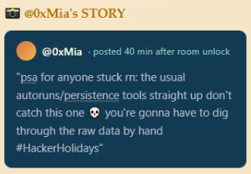
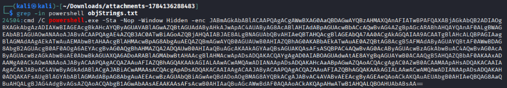
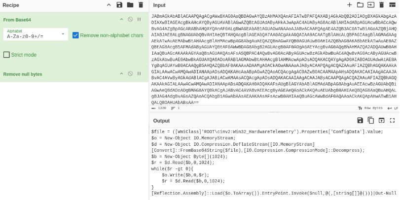
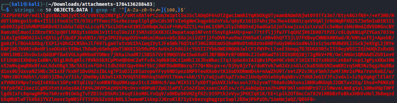
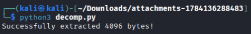
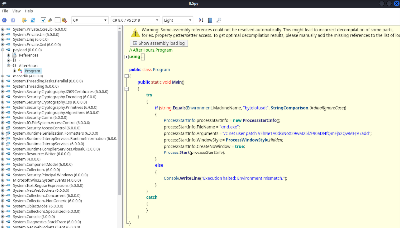
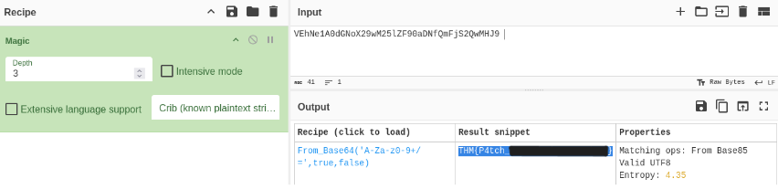

# Day 12 - After Hours

|Category |Difficulty|
|:-------:|:--------:|
|Forensics|  Medium  |

**Skills learned:**
* Using the `strings` command to analyze files
* Decompressing data with a python script
* Decrpyting strings with CyberChef
* Reverse engineering a binary with ILSpy

## Concierge Briefing

**File attachment(s):**
```text
Attachments-1784136288483.zip
├── INDEX.BTR
├── MAPPING1.MAP
├── MAPPING2.MAP
├── MAPPING3.MAP
└── OBJECTS.DATA
```

## Today's Itinerary
* Parse the provided system artifacts for hidden custom configuration data
* Locate the malicious class and extract its embedded payload
* Decode the payload and submit the recovered flag

## Provided Hint


## Initial Steps
I first had to research what exactly the provided artifacts were:
```
In Windows forensics, an INDEX.BTR file is a core binary component of the Windows Management Instrumentation (WMI) repository. Located in C:\Windows\System32\wbem\Repository\, it functions as a B-tree index file used by the operating system to quickly locate class definitions, namespaces, and persistent event subscriptions stored in the companion OBJECTS.DATA file.

Malicious Persistence: Advanced attackers abuse WMI event subscriptions (CommandLineEventConsumer or ActiveScriptEventConsumer) to achieve fileless persistence that survives reboots.
Evidence Location: The configuration details of these hidden subscriptions reside inside the WMI repository files (INDEX.BTR, OBJECTS.DATA, and MAPPING*.MAP), making them critical targets during incident response.
Detection Challenges: Because standard triage packages and automated forensic tools often skip parsing the WBEM repository directory, malicious WMI bindings can easily go unnoticed.

Specialized Parsers: Analysts use dedicated tools like python-cim, WMIParser, or specialized KAPE targets to parse the binary structure of INDEX.BTR and OBJECTS.DATA offline.
```

I first tried to parse the provided files using [gkape](https://ericzimmerman.github.io/KapeDocs/#!Pages%5C5.-gkape.md) as well as other WMI Parser tools such as [this](https://github.com/AndrewRathbun/WMI-Parser). None were helpful in extracting useful data from the files.

## Finding the Flag
I eventually pivoted to using `strings` to extract useful strings from each of the given files. The **OBJECTS.DATA** file gave an interesting clue.

I used the `strings` command to extract strings with minimum length of *6* from the OBJECTS.DATA file and saved the output to a new file named *objStrings.txt*:
`strings -a -n 6 OBJECTS.DATA > objStrings.txt`

Then we can examine the extracted strings in the objStrings.txt file using `grep`. One of the phrases I searched for in the list of strings was **powershell**: `grep -in powershell objStrings.txt`, which gave us an encrypted PowerShell command:



We can decrypt the PowerShell using the [CyberChef](https://gchq.github.io/CyberChef/) recipe **From Base64**.



The PowerShell code retrieves a Base64 payload from the WMI class property **ConfigData**, uses a *DeflateStream* to decompress the data, rebuilds the data into a memory stream *$o* before loading and executing its main entry point (EntryPoint.Invoke).

We need to extract the Base64 contents of **ConfigData** from the Objects.DATA file, so I used `strings` again to do this. Grab all strings from the file whose length is at least 50, then use `grep` with a regular expression to filter Base64 characters. The full command I used was: ` strings -n 50 OBJECTS.DATA | grep -E '^[A-Za-z0-9+/=]{100,}$'`.



Next, we need to decompress the data just as *DeflateStream* does. I used a python script for this, which saves the decompressed data to a file named **payload.exe**:
```python
import base64
import zlib

# Replace with the extracted ConfigData string
b64_config_data = "[Full value of extracted ConfigData from last step goes here]"

compressed_data = base64.b64decode(b64_config_data)
# -15 forces raw DEFLATE decompression (matching .NET DeflateStream)
decompressed_data = zlib.decompress(compressed_data, -15)

with open("payload.exe", "wb") as f:
    f.write(decompressed_data)

print(f"Successfully extracted {len(decompressed_data)} bytes!")
```

Run the script and we should have extracted the full payload:



To ensure the extracted data is a .NET binary, we can run the `file` command against it: `file payload.exe`. The output was:
```
payload.exe: PE32 executable for MS Windows 4.00 (GUI), Intel i386 Mono/.Net assembly, 3 sections
```

Now we need to reverse engineer the .NET binary to retrieve the flag. I used the tool [ILSpy](https://github.com/icsharpcode/AvaloniaILSpy/releases). I downloaded the **Linux x64** version.

Launching the tool with `./ILSpy` and examining our .NET binary, we can find it's main function under **payload(0.0.0.0) > AfterHours > Program**.



Inside the Main function, we can see the command ` net user patch VEhNe1A0dGNoX29wM25lZF90aDNfQmFjS2QwMHJ9 /add` was executed, which created a new user account named **Patch** with their password being **VEhNe1A0dGNoX29wM25lZF90aDNfQmFjS2QwMHJ9**. The password seems to be an encrypted value...

## Flag
Going back to [CyberChef](https://gchq.github.io/CyberChef/), we can decrypt the string using the **Magic** recipe.



**THM{P4tch_\*\*\*\*\*\*_\*\*\*_\*\*\*\*\*\*\*\*}**