# Day 14 - Management Wants a Word

|Category |Difficulty|
|:-------:|:--------:|
|Forensics|   Hard   |

**Skills learned:**
* Uncovering Chrome browser AppData using SQLite
* Dumping and cracking local user account credentials
* Recover DPAPI-protected secrets by decrypting the Master Key
* Decrypt passwords saved by a Chrome browser
* Mounting a VeraCrypt container and accessing its contents

## Concierge Briefing
Housekeeping found a guest's laptop left behind after an early checkout, Room 214, registered to a "Vera." IT pulled a full triage before wiping it for the next guest.
Hunt down the artifacts scattered across her machine and figure out how they fit together. Somewhere in that trail is a password she never meant to leave behind. Follow it, and it'll open a door to something she was keeping very quiet.

**File attachment(s):**
```text
management-wants-a-word-forensics-hh-day-14-1785854680266.zip
└── KAPE
    └── C
        ├── Users
        └── Windows
```

## Today's Itinerary
* Take a closer look at what she left behind
* Some things aren't as locked away as she thought
* Find out what she was hiding, and claim the flag

## Provided Hint
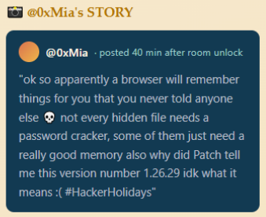

## Initial Steps
I began this challenge by examining the full contents of the provided attachment file. There are a few notable findings:
* There is a user named **vera**, and we have their NTUSER.dat files, along with their AppData and Documents folders
* Vera's **Documents** folder contains 1 extensionless file named **backup**
* All extracted registry hives can be found in the **C\Windows\System32\config** directory
* Vera used a *Chrome for Testing* browser, whose data can be found in the **C\Users\vera\AppData\Local\Google\Chrome for Testing\User Data\Default** directory.

## Finding the Flag
The full process of finding this challenge's flag can be broken down into 6 steps:
1. Discover browser activity and saved passwords
2. Dump and crack local user credentials
3. Use Local User credentials to decrypt Vera's DPAPI Master Key
4. Decrypt Chrome's AES key using Vera's DPAPI Master Key
5. Decrypt a password saved in Chrome using Chrome's AES Key
6. Mount a VeraCrypt container and access its contents

### Discovering Browser Activity and Saved Passwords
Inside the directory **C\Users\vera\AppData\Local\Google\Chrome for Testing\User Data\Default**, there are two very useful files we can use:
* **history** - contains browser history (URL, page title, visit time, etc)
* **Login Data** - contains passwords saved by the browser, including URL, username, password blob, etc.

We can read each of these files using [DB Browser for SQLite](https://sqlitebrowser.org/). Open the tool and select each of these files to examine their contents. When selecting the files, you need to **look for all file types, not just database files**.

Opening the **history** file, click the **Browse Data** tab, and select the table named **urls** in the dropdown list. We see six entries in the list, most notably the *SecureVault Portal* located at http://bytelotus.thm:8080/. This is a clue to save for later.

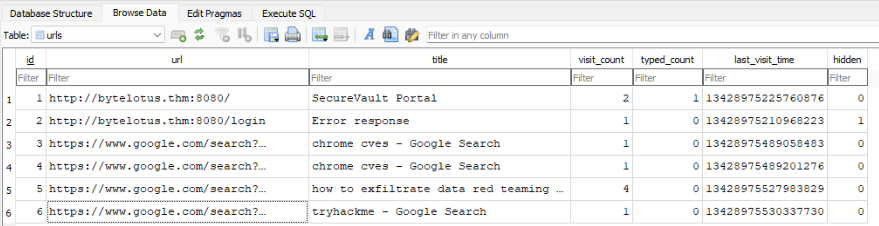

Opening the **Login Data** file, we need to click the **Browse Data** tab, but instead select the table named **logins** in the dropdown list. There is only one password listed, whose *origin_url* is the same as the one found in the browser history. We can see that there is a username **VeraSecretVault** and the password is saved as an encrypted BLOB.

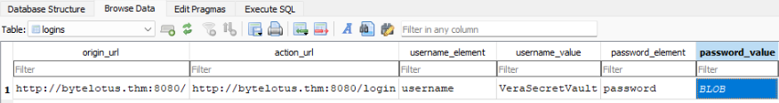

DB Browser provides us the full hexdump of the password blob:
```
0000  76 31 30 c8 8a 72 a6 4f 35 f6 3e 88 3e a0 a7 f6  v10..r.O5.>.>... 
0010  4a 68 70 e4 6b 0b bb 46 9a 75 6e da 88 b7 e3 24  Jhp.k..F.un....$ 
0020  c3 e1 c5 10 15 aa 6f d8 d6 5a c4 89 61 e1 ea 32  ......o..Z..a..2 
0030  4c e1 70 78 07 fe b3 d7                          L.px....      
```

The **magic bytes** of this password blob are *v10*, which means:
```
In Google Chrome, the string v10 represents the magic bytes (version tag prefix) used to identify data encrypted via Chrome's Local State master key. It is primarily found in SQLite databases within a user's Chrome profile, such as the Cookies and Login Data (passwords) files.
The presence of v10 indicates that the data was encrypted using AES-256-GCM (on Windows) or AES-128-CBC (on macOS/Linux), a standard introduced in Chrome 80 to replace older Windows DPAPI-only encryption.
```

Now we must begin the process of decrypting this blob: 
1. Extracting and decrypting the master key
2. Decrypt Chrome's AES key
3. Use the AES key to decrypt the blob.

### Dump and Crack Local User Credentials
Before we extract and decrypt Vera's Master Key, we must first dump and crack Vera's local user credentials. We can user Vera's password to decrypt their Master Key file.

I used Kali's [Impacket](https://www.kali.org/tools/impacket/) suite of tools for this step. The full **python3-impacket** package can be installed using `sudo apt install python3-impacket`.

We can use `impacket-secretsdump` to extract user password hashes from the SAM hive (-sam), while pointing to the SYSTEM hive (-system) using the SYSTEM boot key to decrypt the SAM hashes. LOCAL tells secretsdump that we're parsing an offline local registry hive files.

The full command I used was: 
```
impacket-secretsdump -sam /home/kali/Downloads/management-wants-a-word-forensics-hh-day-14/KAPE/C/Windows/System32/config/SAM -system /home/kali/Downloads/management-wants-a-word-forensics-hh-day-14/KAPE/C/Windows/System32/config/SYSTEM LOCAL
```

The result was 5 dumped user hashes, including **vera's**:

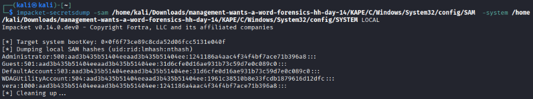

Vera's hash is: `vera:1000:aad3b435b51404eeaad3b435b51404ee:1241186a4aac4f34f4bf7ace71b396a8:::`

The full hash has the format `(uid:rid:lmhash:nthash)`. We can crack the **nthash** using online tools such as [CrackStation](https://crackstation.net/). Paste the nthash value and attempt to crack the password.

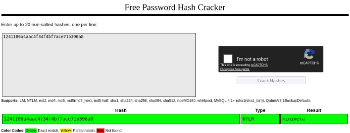

We've now cracked Vera's password: **minivera**. We can use this password to now decrypt Vera's DPAPI Master Key.

### Use Local User Credentials to Decrypt Vera's DPAPI Master Key
We can use `impacket` again to decrypt the Master Key, but we need to provide three things:
1. The Master Key file path (-file)
2. Vera's Windows User SID (-sid)
3. Vera's plaintext password (-password)

The full command I used was: 
```
impacket-dpapi masterkey -file /home/kali/Downloads/management-wants-a-word-forensics-hh-day-14/KAPE/C/Users/vera/AppData/Roaming/Microsoft/Protect/S-1-5-21-2529683458-431225740-1723070931-1000/c90719ef-5b98-474e-b934-136d606a702a -sid S-1-5-21-2529683458-431225740-1723070931-1000 -password minivera
```

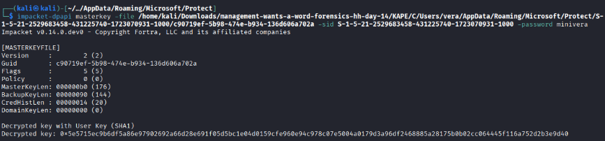

The result is a decrypted Master Key:
`0x5e5715ec9b6df5a86e97902692a66d28e691f05d5bc1e04d0159cfe960e94c978c07e5004a0179d3a96df2468885a28175b0b02cc064445f116a752d2b3e9d40`

We can now take this decrypted Master Key and use is to decrypt the browser's AES key. 

### Decrypt the Chrome Browser's AES Key Using Vera's DPAPI Master Key
To decrypt the browser key, we must follow three steps:
```
1. Read the string from Local State at os_crypt.encrypted_key
2. Decode the Base64 text and strips off the initial 5-byte "DPAPI" header
3. Pass the remaining DPAPI payload to Windows CryptUnprotectData
4. Use the resulting decrypted 32-byte raw AES key along with AES-GCM to decrypt the credentials
```

We can find an encrypted version of Chrome's AES key inside the **Local State** file at the location `C\Users\vera\AppData\Local\Google\Chrome for Testing\User Data\Local State`. We're looking for the value in the **os_crypt.encrypted_key** field.

In this case, the Chrome key is:
```
RFBBUEkBAAAA0Iyd3wEV0RGMegDAT8KX6wEAAADvGQfJmFtOR7k0E21ganAqEAAAADQAAABHAG8AbwBnAGwAZQAgAEMAaAByAG8AbQBlACAAZgBvAHIAIABUAGUAcwB0AGkAbgBnAAAAEGYAAAABAAAgAAAA4t9N2ZWJ6/3gYrwIs9GRKJIs/cW8DXo55B2nY8jabSQAAAAADoAAAAACAAAgAAAAQXy466r2xSWddI+G09UlfQvFHsjD1ctlZnvVCL10R9IwAAAArDHeduQIrK4XODPWLS/xsuAyZRpOTbd87RH3lkp96YIpuSV/fCTMAr5itJphn/BnQAAAAKI1dsBXRgJu8ENjGjStvxSEyReIxqJOfXkKQNoMu7rv/JQfjXhJYlCWlr0KDh+1s9zhrgJM8A74VyeZqhD8yXU=
```

I Used a quick python script to Base64 decode the full key string, remove the "DPAPI" prefix, and write the new value to a file.

```python
import json, base64
fullString = "RFBBUEkBAAAA0Iyd3wEV0RGMegDAT8KX6wEAAADvGQfJmFtOR7k0E21ganAqEAAAADQAAABHAG8AbwBnAGwAZQAgAEMAaAByAG8AbQBlACAAZgBvAHIAIABUAGUAcwB0AGkAbgBnAAAAEGYAAAABAAAgAAAA4t9N2ZWJ6/3gYrwIs9GRKJIs/cW8DXo55B2nY8jabSQAAAAADoAAAAACAAAgAAAAQXy466r2xSWddI+G09UlfQvFHsjD1ctlZnvVCL10R9IwAAAArDHeduQIrK4XODPWLS/xsuAyZRpOTbd87RH3lkp96YIpuSV/fCTMAr5itJphn/BnQAAAAKI1dsBXRgJu8ENjGjStvxSEyReIxqJOfXkKQNoMu7rv/JQfjXhJYlCWlr0KDh+1s9zhrgJM8A74VyeZqhD8yXU="

aes = base64.b64decode(fullString)
aesBlob = aes[5:] # Remove the DPAPI prefix

with open("encrypted_AES.bin", "wb") as file:
    file.write(aesBlob)
```

After executing the script, we have a new **encrypted_AES.bin** file that contains the Chrome AES key without the "DPAPI" prefix. We can pass this to Windows CryptUnprotectData using `impacket`. The command `impacket-dpapi` needs the AES key file (-file) as well as Vera's DPAPI key (-key) in order to decrypt the Chrome AES key material.

The full command I used was:
```
impacket-dpapi unprotect -file encrypted_AES.bin -key 0x5e5715ec9b6df5a86e97902692a66d28e691f05d5bc1e04d0159cfe960e94c978c07e5004a0179d3a96df2468885a28175b0b02cc064445f116a752d2b3e9d40
```

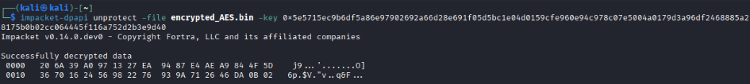

The result is a fully decrypted Chrome AES-256 key:
`20 6A 39 A0 97 13 27 EA 94 87 E4 AE A9 84 4F 5D 36 70 16 24 56 98 22 76 93 9A 71 26 46 DA 0B 02`

Our next step is to use this AES key to decrypt Vera's *SecureVault password* saved by the Chrome browser.

### Decrypt Vera's Password Saved in Chrome Using Chrome's AES Key
There are four steps to follow to decrypt Vera's SecureVault password:
1. Convert the AES-256 key and SecureVault password from hex to raw byte sequences
2. Parse Vera's password to extract the **nonce, authentication tag, and password data** it contains
3. Decrypt the password while verifying the authentication tag is valid
4. Convert the decrypted bytes into a readable format

I used another python script for this task:
```python
from Crypto.Cipher import AES

VeraPW = bytes.fromhex("763130c88a72a64f35f63e883ea0a7f64a6870e46b0bbb469a756eda88b7e324c3e1c51015aa6fd8d65ac48961e1ea324ce1707807feb3d7")
aesKey = bytes.fromhex("206A39A0971327EA9487E4AEA9844F5D3670162456982276939A712646DA0B02")

nonce = VeraPW[3:15]          # Extract the Initialization Vector
ciphertext = VeraPW[15:-16]   # Extract the encrypted password value
tag = VeraPW[-16:]            # Extract the authentication tag (ensures no tampering)

cipher = AES.new(aesKey, AES.MODE_GCM, nonce=nonce)  # Creates a new AES cipher instance using the Chrome AES key, using GCM mode and the nonce

# Decrypts the ciphertext while calculating and verifying whether the authentication tag is valid
# Then converts the output to a readable, plaintext format
print(cipher.decrypt_and_verify(ciphertext, tag).decode())  
```

This script required the installation of the **pycryptodome** package: `pip install pycryptodome`.

Executing the script returns us Vera's plaintext **SecureVault password**. 

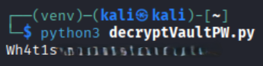

Now we can use this password to open Vera's SecureVault!

### Mount a VeraCrypt Container and Access its Contents
We've reached the final step of this challenge: mounting Vera's VeraCrypt container inside the **Documents\backup**. We can determine that this file is a VeraCrypt container using 2 clues: the hint "version number 1.26.29" and the *backup* file itself.

Searching the phrase *software version 1.26.29* online, we get the following result:
```
The software version 1.26.29 primarily points to a couple of major technology releases:
VeraCrypt 1.26.29
VeraCrypt, the popular open-source disk encryption software, launched version 1.26.29 on June 9, 2026.
```

In addition, we can determine if the **backup** file is a VeraCrypt container by its attributes. Online research tells us:
```
Telltale Indicators of a VeraCrypt Container
1. File Size Characteristics: VeraCrypt volumes are structured in precise blocks. Their total file sizes are typically exact multiples of 512 bytes. Additionally, users often choose large, flat, round-number file sizes (e.g., exactly 5GB or 50GB) for custom containers.
2. File Extensions: While users can name a container anything, common non-standard extensions used or associated with volumes include .hc, .tc, or .vol. However, a container can also be saved with a misleading extension (like .bak or .mp4) or no extension at all.
```

We already know that the **backup** file has no extension, but we can confirm the file size using the **File Explorer**. The file's size is exactly **100MB** (102,400KB).

We can download VeraCrypt from [here](https://veracrypt.io/en/Downloads.html). I used the **Portable version** for this task. After downloading, I ran the *VeraCrypt-x64* executable.

Select the **backup** file. When opening this file, we need to search by **All Files (*.*)**. After selecting the file, choose a lettered drive to mount to, then click the **Mount** button to mount the container to a local drive.

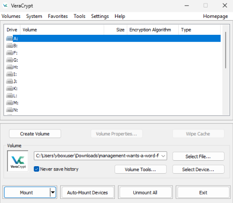

Now we're prompted to enter a password. Use Vera's SecureVault password from the previous step.

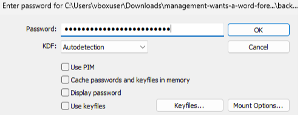

The container has successfully mounted to our local drive (in my case A:). We can directly access the files inside using the **File Explorer**. Look around to find the flag.

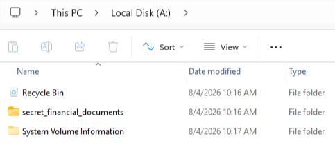

## Flag
The flag can be found in the **secret_financial_documents\important_invoice_byte_lotus.pdf** file. Doublie-click the file to open it and find the flag in the invoice data.

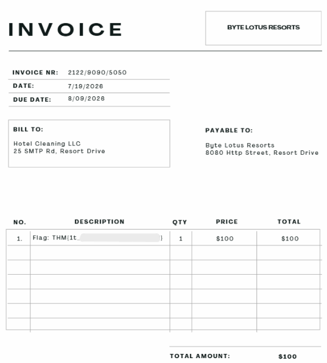

**THM{1t_\*\*\*_\*\*\*\*_\*\*\*_\*\*\*\*\*\*\*}**