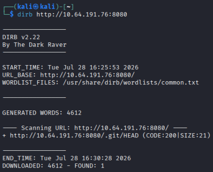

# Day 2 - Room 404

|Category|Difficulty|
|:------:|:--------:|
|   Web  |Very Easy |

**Skills learned:**
* Web server sub-directory enumeration via Dirb
* GitHub respository dumping

## Concierge Briefing
He booked the quiet room. It's not on the floor plan, not in the brochure, not on any door. But port 8080 is wide open, and the rooms it never lists are the ones worth finding.
Welcome to the Byte Lotus, where the WiFi is open, the app is free, and the concierge already knows your coffee order. You spend these first days as a guest who simply notices things — a room that isn't on the floor plan, packets that leave every night at the same hour, a profile assembled from two breakfasts and a livestream.
The Byte Lotus guest-experience platform went live in a hurry, and the night-shift developer shipped more than the website.

## Today's Itinerary
* Dump the exposed source code

## Initial Steps
I began this challenge by running the provided lab machine and running [dirb](https://www.kali.org/tools/dirb/) against its web server to enumerate sub-directories.



There is one finding: http://[MACHINE IP]:8080/.git/HEAD

Opening this in a web browser shows an index listing of the git repo:


## Finding the Flag
I had to research how to dump the files behind an exposed `.git/HEAD` file. Doing so, I came across the tool [git-dumper](https://github.com/arthaud/git-dumper), which will "dump a git repository from a website".

I installed this tool inside a new virtual environment on my machine:
```
python3 -m venv .venv
source .venv/bin/activate
pip install git-dumper
```

The usage of this tool is: `git-dumper [options] URL DIR` where **URL** is the site hosting the repository and **DIR** is the directory on your local machine that will store the tool's output.

I dumped the repository using the command `git-dumper http://[MACHINE IP]:8080/.git /home/kali/Desktop/THM-HH26`

Navigating to the output directory and running `ls` will list all the files we've discovered. After that, we can try reading the file contents with `cat`.


We can find the flag inside the contents of the repo's README file.

## Flag
**THM{byt3_\*\*\*\*\*_\*\*\*\*\*_\*\*\*\*\*\*\*}**