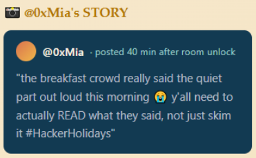
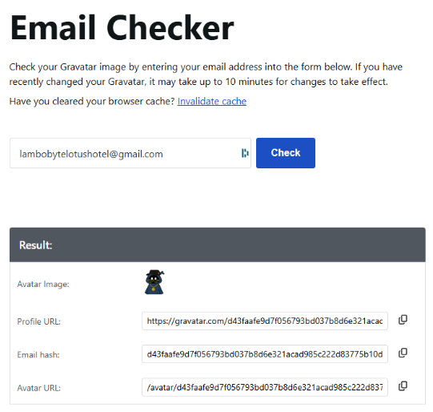
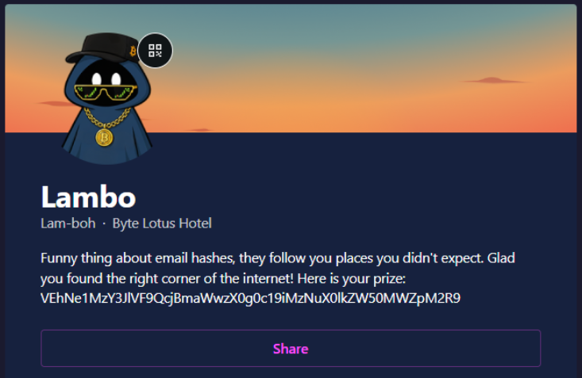

# Day 6 - Overheard at Breakfast

|Category|Difficulty|
|:------:|:--------:|
| OSINT  |   Easy   |

**Skills learned:**
* Using search engines to find unknown social media websites
* Decrypting strings using CyberChef

## Concierge Briefing
The breakfast terrace is loud this morning, clinking cutlery, espresso machines, the usual chatter. One guest couldn't help but linger at a nearby table, seeing more of a conversation than they were meant to.
When the table's occupant stepped away for a refill, they seized the moment and grabbed a screenshot before it could disappear. Somewhere in that conversation is enough to track down an account nobody was supposed to find.

**File attachment(s):**
```text
overheard-at-breakfast-1784259780309.zip
└── conversation.png
```

## Today's Itinerary
* Analyze the provided conversation for identifying details
* Extract the relevant clues
* Locate the hidden account
* Submit the flag

## Provided Hint


## Initial Steps
I downloaded the attached file, which was a screenshot of messages shared between guests Ponzi and Lambo. The messages include the following:


Now we know we must find a social media page that *links other media accounts* whose name begins with the letter **G**.

## Finding the Flag
I started with an online search using the phrase 'online tool upload profile and link social media accounts'. The AI overview provided a clue:
```
Online tools to upload a profile and link social media accounts include Linktree for a single landing page, Gravatar for a universal digital identity profile, and Buffer for a complete social publishing hub. 
```

It appears that the site **Gravatar** may be the site mentioned by Lambo, but one more search was needed. Searching 'gravatar lambobytelotushotel@gmail.com' led me to:
```
To view or link the globally recognized avatar profile for this email address, you can access the official Gravatar Email Checker.
```

After finding Gravatar's [Email Checker](https://gravatar.com/site/check) page, I entered Lambo's email address to check if they had a Gravatar account.



Opening the **Profile URL** led to Lambo's profile:



Lambo's Gravatar profile header includes an encrypted string, so I used [CyberChef](https://gchq.github.io/CyberChef/) to decrypt it using the **Magic** recipe.

## Flag
**THM{S3creT_\*\*\*\*\*\*\*_\*\*\*_\*\*\*\*_\*\*\*\*\*\*\*\*\*\*}**