# Day 8 - Towel on the Sunbed

|Category|Difficulty|
|:------:|:--------:|
|   Web  |  Medium  |

**Skills learned:**
* Exploit race condition with Burp Suite

## Concierge Briefing
Ponzi found the resort's wellness portal running a little side project called Ponzi — a crypto rewards app, poolside edition. He set his towel down, claimed his daily reward, and went to reapply sunscreen. He came back to find the sunbed had been "claimed" three times over while he wasn't looking.
He's convinced the app owes him a spot in the Whale Vault. The app disagrees, politely, once every 24 hours. Somewhere between his request and the server's clock, there's a gap wide enough to walk a whale through.

## Today's Itinerary
* Create a guest account and explore Ponzi's daily reward mechanism
* Work out exactly what's standing between you and Whale Vault status
* Find your way past it and retrieve the flag from the vault

## Provided Hint
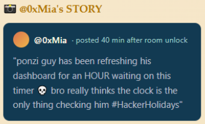

## Initial Steps
Opening the web app, we are brought to the **Ponzi Portfolio** page. We need to create a guest account, so **Register** for a new user.

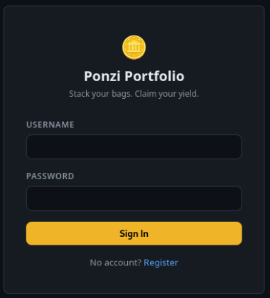

After registering our new account and logging in, we can see our new portfolio dashboard:

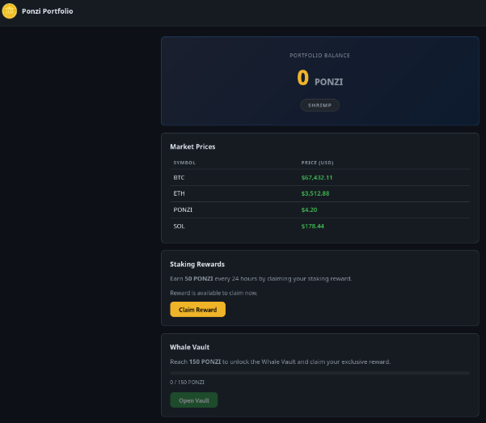

We currently have 0 PONZI coins, and our vault has *Shrimp* status. Somehow, we need to abuse the **Claim Reward** mechanism to get a total of at least 150 PONZI coins to achieve *Whale* vault status.

## Finding the Flag
I began trying to solve this challenge by using Burp Suite to intercept the request behind the **Claim Reward** button and manually editing the response. The response fields include *newBalance* and *tier*, which I edited to be 150 and Whale respectively, before forwarding the manipulated response.

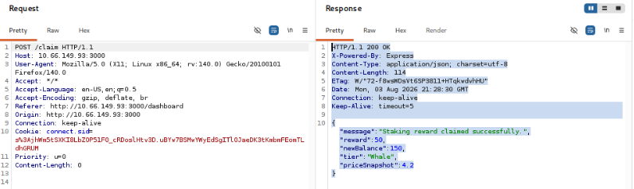

This method did not appear to be successful, so I pivoted to attempt intercepting a `GET /dashboard/api/me` request and editing the response to include **balance:150**, and **tier:Whale**.

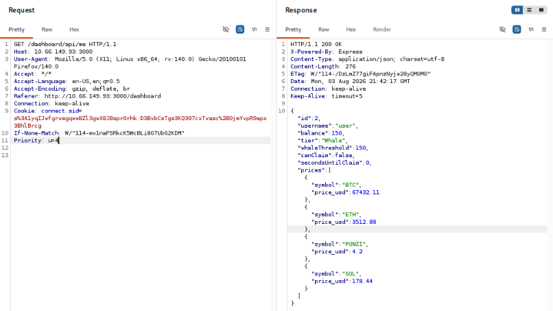

I thought that this method was succcessful, as we can see the balance value is 150 PONZI, the vault status is "Whale" and the green **Open Vault** button can be clicked. However, I could not get the flag this way becaause my resulting `GET /vault` request returned **403 Forbidden**.

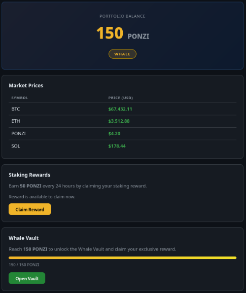

After some research, I found the methodology needed to solve this challenge: using Burp Suite to **send multiple of the same requests in parallel** to exploit the web app's reward race condition.

We can do that by following these steps:
1. Register a new user account (or start with an existing user who hasn't tried claiming any rewards yet)
2. Intercept the `POST /claim` request and send it to **Burp's Repeater**
3. Add the tab to a new group
4. Duplicate the `POST /claim` request tab at least 3-5 more times
5. Send all claim requests in parallel

Once the intercepted `POST /claim` request has been sent to the Repeater, **right click it's numbered tab** and select **Add tab to group**.

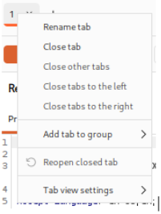

Provide your new group a name then click **Create** to create the new group of requests.

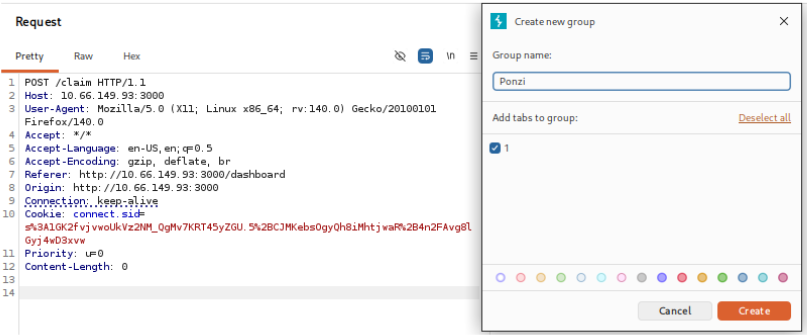

**Right click** the colored group tab and select **Duplicate tab**. Enter the number of times to duplicate it, then click **Duplicate**.

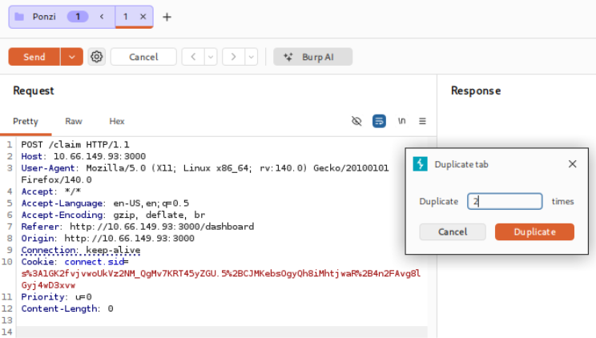

Now **click the dropdown menu** of **Send** button and select **Send group in parallel** to send all `POST /claim` requests at the same time.

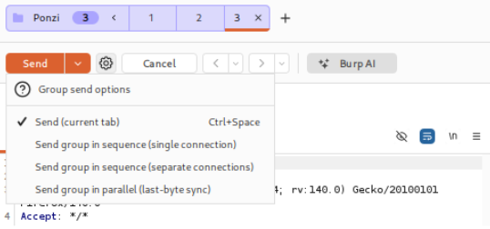

Finally, click the **Send group (parallel)** button and we can see the responses received by each request.

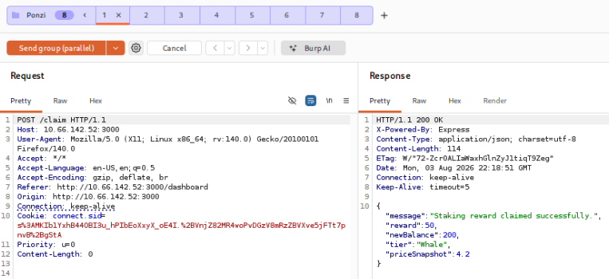

After sending all claim requests, we can refresh the portfolio dashboard page to see what our current balance is:

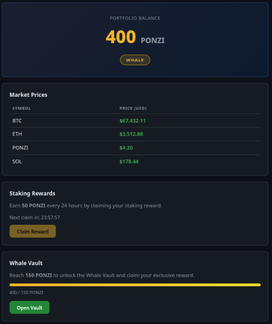

Clicking the green **Open Vault** button now reveals the flag.

## Flag
**THM{t0w3l_0n_th3_\*\*\*\*\*\*_\*\*\*\*\*\*_\*\*\*\*\*}**