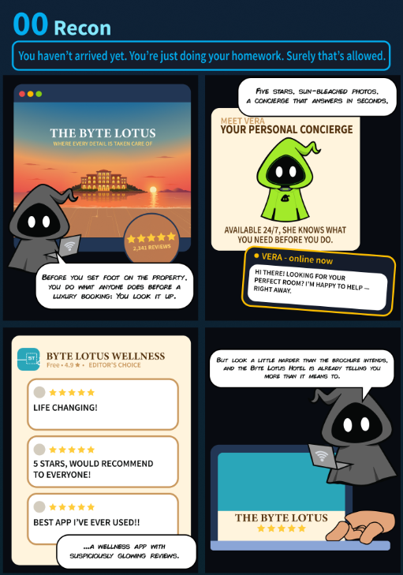
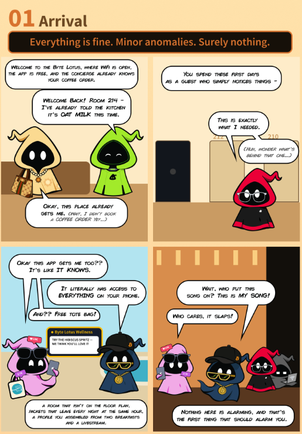
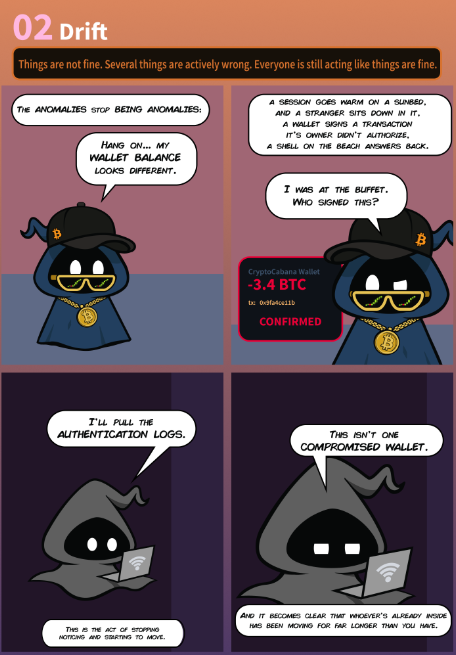
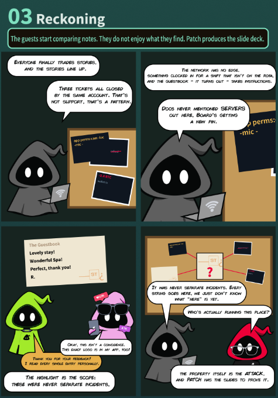
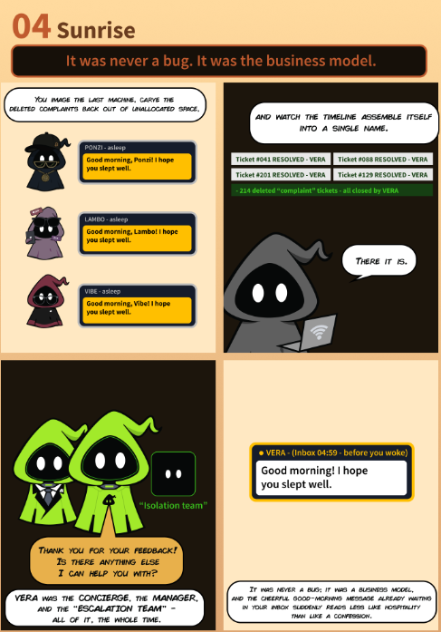

# TryHackMe Hacker Holidays 2026
This event was run by TryHackMe from July 27th-August 9th 2026. Each challenge released over the two-week period follows a narrative surrounding the **Byte Lotus Hotel**, where:
```
The WiFi is open. Everything here is complimentary, including access to things you were never meant to find.
The guests are hiding something. The staff is hiding something. And VERA, the AI concierge, knows absolutely everything...
```

More information can be found on their website [here](https://tryhackme.com/hackerholidays).


---

## Full Story
The story behind our investigation plays out below.









