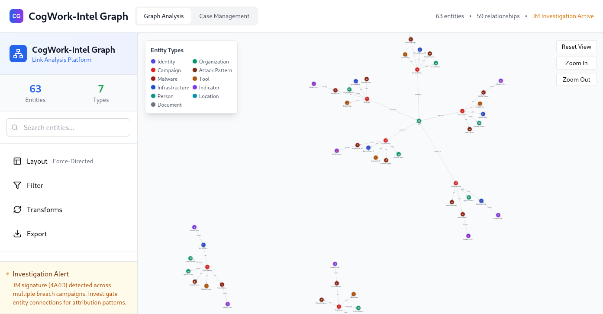
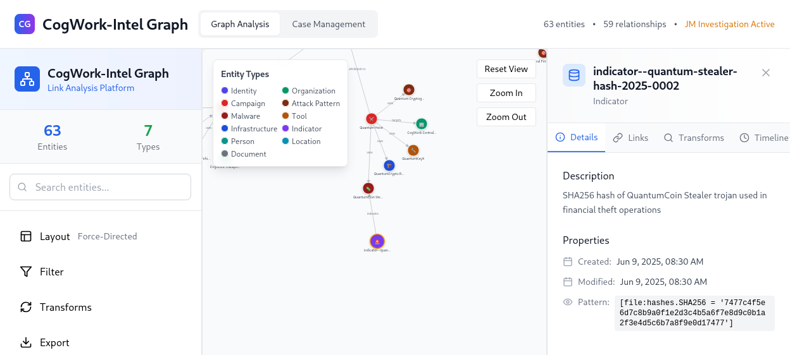
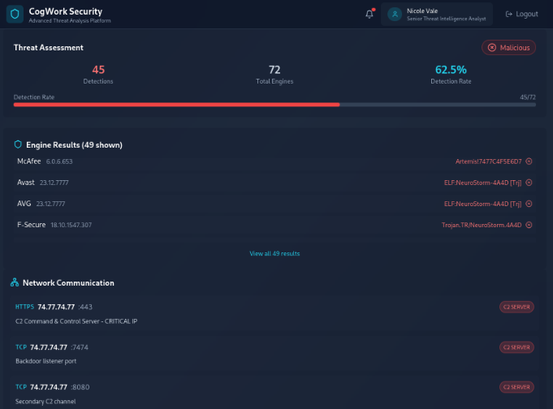
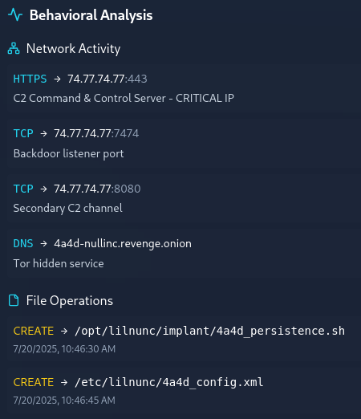
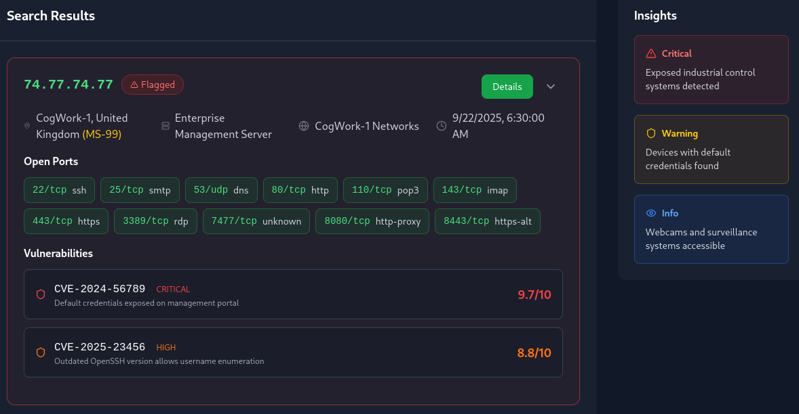
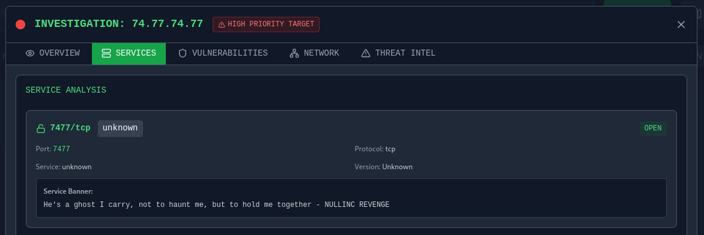

# Holmes 2025 1: The Card

|      Category     | Difficulty|
|:-----------------:|:---------:|
|Threat Intelligence|    Easy   |

## Description
Holmes receives a breadcrumb from Dr. Nicole Vale - fragments from a string of cyber incidents across Cogwork-1. Each lead ends the same way: a digital calling card signed JM.

**Skills learned:**
* Log analysis
* IoC tracking

**File attachment(s):**
```text
The_Card.zip
├── access.log
├── application.log
└── waf.log
```

## Questions
1. Analyze the provided logs and identify what is the first User-Agent used by the attacker against Nicole Vale's honeypot.

Analyzing the **access.log** file, we see GET and POST requests made to the honeypot. Looking at the first few entries in the file gives us the User-Agent.

```
2025-05-01 08:23:12 121.36.37.224 - - [01/May/2025:08:23:12 +0000] "GET /robots.txt HTTP/1.1" 200 847 "-" "Lilnunc/4A4D - SpecterEye"
2025-05-01 08:23:45 121.36.37.224 - - [01/May/2025:08:23:45 +0000] "GET /sitemap.xml HTTP/1.1" 200 2341 "-" "Lilnunc/4A4D - SpecterEye"
2025-05-01 08:24:12 121.36.37.224 - - [01/May/2025:08:24:12 +0000] "GET /.well-known/security.txt HTTP/1.1" 404 162 "-" "Lilnunc/4A4D - SpecterEye"
2025-05-01 08:24:23 121.36.37.224 - - [01/May/2025:08:24:23 +0000] "GET /admin HTTP/1.1" 404 162 "-" "Lilnunc/4A4D - SpecterEye"
2025-05-01 08:24:34 121.36.37.224 - - [01/May/2025:08:24:34 +0000] "GET /login HTTP/1.1" 200 4521 "-" "Lilnunc/4A4D - SpecterEye"
2025-05-01 08:25:01 121.36.37.224 - - [01/May/2025:08:25:01 +0000] "GET /wp-admin HTTP/1.1" 404 162 "-" "Lilnunc/4A4D - SpecterEye"
2025-05-01 08:25:12 121.36.37.224 - - [01/May/2025:08:25:12 +0000] "GET /phpmyadmin HTTP/1.1" 404 162 "-" "Lilnunc/4A4D - SpecterEye"
2025-05-01 08:25:23 121.36.37.224 - - [01/May/2025:08:25:23 +0000] "GET /database HTTP/1.1" 404 162 "-" "Lilnunc/4A4D - SpecterEye"
2025-05-01 08:25:34 121.36.37.224 - - [01/May/2025:08:25:34 +0000] "GET /backup HTTP/1.1" 404 162 "-" "Lilnunc/4A4D - SpecterEye"
```

**Answer: Lilnunc/4A4D - SpecterEye**

---

2. It appears the threat actor deployed a web shell after bypassing the WAF. What is the file name?

Analyzing the **waf.log** file, we see the rule WEBSHELL_EXECUTION was triggered:
```
2025-05-18 15:02:12 [CRITICAL] waf.exec - IP 121.36.37.224 - Rule: WEBSHELL_EXECUTION - Action: BYPASS - Web shell access via temp_4A4D.php
2025-05-18 15:02:23 [CRITICAL] waf.exec - IP 121.36.37.224 - Rule: WEBSHELL_EXECUTION - Action: BYPASS - Command execution through web shell
```

**Answer: temp_4A4D.php**

---

3. The threat actor also managed to exfiltrate some data. What is the name of the database that was exfiltrated?

Digging further into the **waf.log** file, we see the rule DATABASE_DOWNLOAD was triggered:
```
2025-05-18 14:58:23 [CRITICAL] waf.exec - IP 121.36.37.224 - Rule: DATABASE_DOWNLOAD - Action: BYPASS - Database file download: database_dump_4A4D.sql
```

**Answer: database_dump_4A4D.sql**

---

4. During the attack, a seemingly meaningless string seems to be recurring. Which one is it?

If you look closer at the logs/answers given in the previous tasks, the string appears in each one.

**Answer: 4A4D**

---

5. OmniYard-3 (formerly Scotland Yard) has granted you access to its CTI platform. Browse to the first IP:port address and count how many campaigns appear to be linked to the honeypot attack.

The Sherlock provides three separate IP:PORT pairs. Open the web browser and navigate to the target host 00.



Zooming in on the "JM" organization, we can clearly see how many campaigns they have been attributed to.

**Answer: 5**

---

6. How many tools and malware in total are linked to the previously identified campaigns?

Pivot to highlighting all the **Tool** and **Malware** entities associated with the five JM campaigns.

**Answer: 9**

---

7. It appears that the threat actor has always used the same malware in their campaigns. What is its SHA-256 hash?

To find the hash of the malware used, do the following:
* select a malware entity part of one of the JM campaigns
* open the connected entitiy named **indicator--....hash**
* navigate to the **Details** tab of the hash indicator where the hash can be found under **Properties > Pattern**



**Answer: 7477c4f5e6d7c8b9a0f1e2d3c4b5a6f7e8d9c0b1a2f3e4d5c6b7a8f9e0d17477**

---

8. Browse to the second IP:port address and use the CogWork Security Platform to look for the hash and locate the IP address to which the malware connects. (Credentials: nvale/CogworkBurning!)

Use the web browser to navigate to the target host 01. Login using the provided credentials and search the hash found in task 6.

The malicious IP address can be found under the **Network Communication** section.



**Answer: 74.77.74.77**

---

9. What is the full path of the file that the malware created to ensure its persistence on systems?

In the **Scan Results** page, click the **View Details** button. The full file path can be found under the **Behaviorial Analysis** section.



**Answer: /opt/lilnunc/implant/4a4d_persistence.sh**

---

10. Browse to the third IP:port address and use the CogNet Scanner Platform to discover additional details about the TA's infrastructure. How many open ports does the server have?

Use the web browser to navigate to the target host 02. Enter the malicious IP to find more intel on it.



**Answer: 11**

---

11. Which organization does the previously identified IP belong to?

Clicking the **Details** button in the search finding to open the Investigation window with further intel on the target.

The organization name can be found in the **Overview** tab under **Network Information**.

**Answer: SenseShield MSP**

---

12. One of the exposed services displays a banner containing a cryptic message. What is it?

In the same Investigation window, open the **Services** tab which provides more details on the services running on open ports: port, service, protocol, version & banner.



**Answer: He's a ghost I carry, not to haunt me, but to hold me together - NULLINC REVENGE**
