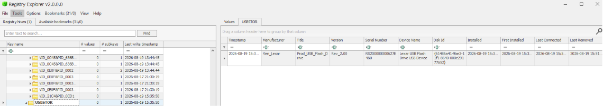
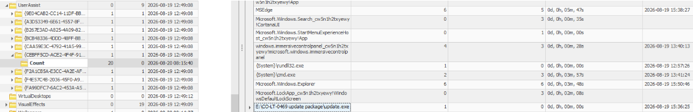
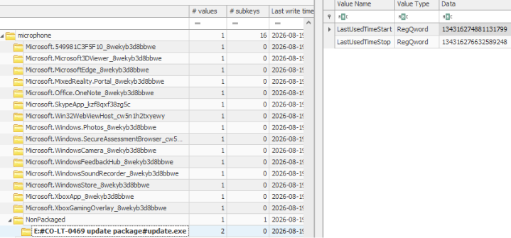
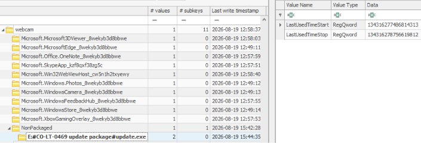

# Paper Ghost

| Category|Difficulty|
|:-------:|:--------:|
|Forensics|   Easy   |

**Skills learned:**
* Examining Windows Registry hives finding malicious activity with Registry Explorer
* Parsing Windows System Resource Usage Monitor (SRUM) database with SrumECmd.exe
* Parsing Windows Index Database (Windows.edb) with a python script

## Description
A recent contractor had passed every check, received a badge, and entered the building without challenge. Nothing in the routine paperwork looked alarming.

When the records were examined together, small inconsistencies appeared. Lestrade sealed the files before anyone decided they were harmless.

One contractor badge had entered the corridor near Clara Voss's office. The vistor looked like any support worker carrying routine equipment.

Soon afterward, Clara used a device presented as an update. Her workstation was preserved, but what had happened and who was responsible remained unproven.

**File attachment(s):**
```text
PaperGhost.zip
├── PaperGhost
│   └── Triage
│       └── C
└── Holmes CTF 2026 - Sherlock 04 - The False Employee.pdf
```

## Questions
**1. The rookie's first move was a planted USB. When did Clara Voss first connect the device Elias Venn left at her desk? (YYYY-MM-DD hh:mm:ss)**

After researching where in the Registry stores USB device data, we need to find the timestamp of USB connection in the **SYSTEM** hive under the `CurrentControlSet\Enum\USBSTOR` key. It holds a record of every external storage device plugged into the system - including device make, model, and serial number.

The **Last write timestamp** of this key tells us when the device was connected to the host machine.



**Answer: 2026-08-19 15:35:50**

---

**2. Every USB carries a serial scar. What serial number did the dropped device leave behind? (string)**

The same Registry key we examined in Task 1 is useful here. We can find the USB device's serial number inside the **Serial Number** column.

**Answer: RS200000000627E4&0**

---

**3. VON BORK's payload hid inside a fake update package Elias delivered. What is the full path of the payload? (full path of file, starting with drive letter)**

Since we already know that Clara initiated the 'update', we can find the full path inside their **NTUSER.dat** hive, under the key `Software\Microsoft\Windows\CurrentVersion\Explorer\UserAssist`.



**Answer: E:\CO-LT-0469 update package\update.exe**

---

**4. Believing it a routine update, Voss launched the spyware. At what exact timestamp did she execute the malicious package? (YYYY-MM-DD hh:mm:ss)**

The same registry key we examined in Task 3 is useful here. We can find the timestamp of execution inside the **Last Executed** column.

**Answer: 2026-08-19 15:36:25**

---

**5. DIOGENES tagged the USB with an asset name that surfaced as the device name on connection. What was it? (string)**

To find the USB device's assigned name (better known as its **friendly name**), we need to look back in the **SOFTWARE** hive, under the key `Microsoft\Windows Portable Devices\Devices`, but we have to determine which of the subkeys relates to the malicious USB.

We can find the device's name in the **FriendlyName** column.

**Answer: CO-USB-0091**

---

**6. Once C2 Access was live, VON BORK's listening post woke the microphone to spy on Voss's meetings. At what time did capture begin? (YYYY-MM-DD hh:mm:ss)**

After researching where the Registry holds microphone activation data, we need to look inside Carla Voss's **NTUSER.dat** hive. The activation timestamp can be found under the `Software\Microsoft\Windows\CurrentVersion\CapabilityAccessManager\ConsentStore\microphone` key. There is a subkey `NonPackaged` that contains the malicious payload's path. Opening this and checking the **Data** of the **LastUsedTimeStart** value will tell us when the microphone capture began. 



This value is stored as the Windows FILETIME format and must be converted to a timestamp. We can use [EpochConverter](https://www.epochconverter.com/ldap) to convert it. 

**Answer: 2026-08-19 15:38:08**

---

**7. VON BORK mapped Voss's office through her webcam — who came and went, what lay on her desk. For how many seconds did the webcam stream? (number)**

Similar to the Microphone activation, we can find the webcam activation data inside Carla Voss's **NTUSER.dat** hive under the `Software\Microsoft\Windows\CurrentVersion\CapabilityAccessManager\ConsentStore\webcam` key.



We need to convert both the **LastUsedTimeStart** and **LastUsedTimeStop** values from FILETIME to timestamp format using [EpochConverter](https://www.epochconverter.com/ldap), then calculate the difference in seconds.

The LastUsedTimeStart was **15:42:28** and **LastUsedTimeStop** was **15:44:35**. The time difference is 2 minutes and 7 seconds, or a total of 127 seconds.

**Answer: 127**

---

**8. The riverside relay drank Voss's secrets. How many decimal megabytes of outbound traffic flowed from the compromised machine to the C2? (***.******)**

I used Eric Zimmerman's [SrumECmd](https://ericzimmerman.github.io/#forensic-tools) to parse the Windows System Resource Usage Monitor (SRUM) database *SRUDB.dat* and tell us the network usage for each process.

The full command I used was `SrumECmd.exe -f "C:\path\to\PaperGhost\PaperGhost\Triage\C\Windows\System32\SRU\SRUDB.dat" -r "C:\path\to\PaperGhost\PaperGhost\Triage\C\Windows\System32\config\SOFTWARE_clean" --csv "C:\path\to\tool_output"`. 

The command breakdown is:
* **-f**: Specify the full path to the SRUM database file to analyze
* **-r**: Points to the Windows SOFTWARE hive, allowing SrumECmd to resolve numeric identifiers into friendly names
* **--csv**: Save the tool output in a CSV file in the given directory

One of the tool's output files was *20260918205840_SrumECmd_NetworkUsages_Output.csv* which provided network usage for every application. Searching this file for the malicious process **co-lt-0469 update package\update.exe**, we find:

```
Id,Timestamp,ExeInfo,ExeInfoDescription,ExeTimestamp,SidType,Sid,UserName,UserId,AppId,BytesReceived,BytesSent,InterfaceLuid,InterfaceType,L2ProfileFlags,L2ProfileId,ProfileName
228,2026-08-19 15:50:00,\device\harddiskvolume5\co-lt-0469 update package\update.exe,,,UnknownOrUserSid,S-1-5-21-1025544563-1542558241-544662972-1002,cvoss,374,436,615595,172064531,1689399632855040,IF_TYPE_ETHERNET_CSMACD,0,0
```

Where the value of **BytesSent** is 172064531 bytes. Converting this to megabytes provides us the answer.

**Answer: 172.064531**

---

**9. Voss reviewed DIOGENES contractors NAPOLEON may now hunt. What set of credentials did the spying surface for a developer working on DIOGENES tickets? (username:password)**

I had [Gemini](https://gemini.google.com/app) write a script to parse the *Windows.edb* database file located in `PaperGhost/PaperGhost/Triage/C/ProgramData/Microsoft/search/data/applications/windows/Windows.edb`. This database file is used by the Windows Search service to store indexed content, file properties, and search results so the machine can quickly find files.  

There is one table very useful to us in this case: **SystemIndex_PropertyStore**. According to [LevelBlue](https://www.levelblue.com/blogs/spiderlabs-blog/windows-search-index-the-forensic-artifact-youve-been-searching-for/), this table contains additional attributes about the indexed files and folders, including these columns:

```text
WorkID	An integer assigned to the record. Maps to DocumentID in SystemIndex_Gthr table.
System_Search_GatherTime	The time at which the record was indexed in the database, stored in Windows File Time format.
System_Size	The size of the file in bytes.
System_ModifiedTime	The $FN last modified time of the record, stored in Windows File Time format.
System_CreatedTime	The $FN creation time of the record, stored in Windows File Time format.
System_FileOwner 	User who created the file, stored as username.
System_ItemPathDisplay	Full path of the record.
System_ItemType	File type of the record based on the extension of the file. If a file does not have an extension, the value will be a single period (".").
System_FileAttributes	Windows file attributes.
System_Search_AutoSummary	Partial contents of the file. Stroz Friedberg was unable to determine a consistent rule for how many bytes were recorded in this property in Windows 10. See further sections for more information on AutoSummary.
```

By also taking advantage of the column **11-System_FileName**, we can find all the indexed PDF files and grab snippets of their content inside the **4625-System_Search_AutoSummary** column.

The script scans every record in the SystemIndex_PropertyStore table, and for every PDF file found, it maps the WorkID to the filename. Then it collects and prints the content snippets of each PDF file discovered.

The code and its output are below.
```python
import sys
from collections import defaultdict
from dissect.esedb import EseDB

def get_all_pdf_chunks(edb_path):
    print(f"[*] Opening ESE database: {edb_path}")
    with open(edb_path, "rb") as f:
        db = EseDB(f)
        t = db.table('SystemIndex_PropertyStore')
        
        # Dynamically find the WorkID column name
        col_names = [c.name for c in t.columns]
        workid_col = next((c for c in col_names if 'workid' in c.lower()), None)
        print(f"[*] Identified WorkID column: {workid_col}")
        print("[*] Scanning table to map PDFs and aggregate all text chunks...")

        pdf_workids = {}              # WorkId -> Filename mapping
        all_chunks = defaultdict(list) # WorkId -> List of summary text chunks
        
        scanned = 0
        for rec in t.records():
            scanned += 1
            try:
                workid = rec.get(workid_col) if workid_col else None
                
                # Capture the filename and its WorkID
                fn = rec.get('11-System_FileName')
                if fn and isinstance(fn, str) and fn.lower().endswith('.pdf') and workid is not None:
                    pdf_workids[workid] = fn
                
                # Capture any auto-summary chunk tied to this WorkID
                summary = rec.get('4625-System_Search_AutoSummary')
                if summary and workid is not None:
                    all_chunks[workid].append(str(summary))
                    
            except Exception:
                continue
                
            if scanned % 10000 == 0:
                print(f"[*] Scanned {scanned} records...")

        print(f"\n[*] Scan complete. Found {len(pdf_workids)} unique PDF files.")
        print("=" * 60)
        
        # Print all aggregated chunks grouped by WorkID/Filename
        for workid, filename in pdf_workids.items():
            print(f"\n[+] FILE: {filename} (WorkID: {workid})")
            chunks = all_chunks.get(workid, [])
            if chunks:
                for idx, chunk in enumerate(chunks, 1):
                    clean_chunk = chunk.replace('\r', ' ').replace('\n', ' ')
                    print(f"    [Chunk {idx}] {clean_chunk}")
            else:
                print("    [No auto-summary text chunks found]")

if __name__ == "__main__":
    db_path = "/path/to/PaperGhost/PaperGhost/Triage/C/ProgramData/Microsoft/search/data/applications/windows/Windows.edb"
    get_all_pdf_chunks(db_path)
```

Output:
```text
[*] Opening ESE database: /path/to/PaperGhost/PaperGhost/Triage/C/ProgramData/Microsoft/search/data/applications/windows/Windows.edb
[*] Identified WorkID column: WorkID
[*] Scanning table to map PDFs and aggregate all text chunks...

[*] Scan complete. Found 4 unique PDF files.
============================================================

[+] FILE: Driver Update Package.pdf (WorkID: 88)
    [Chunk 1] 1/2 Briefing Q4 BRIEFING NOTES — DRIVER UPDATE PACKAGE Ministerial Briefing Office — IT Support For asset CO-LT-0469 (user: cvoss) Classification: OFFICIAL -----------------------------------------------------------------------PACKAGE CONTENTS -----------------------------------------------------------------------This package contains the pending driver update for the Dell Latitude 5440 assigned to the Ministerial Briefing Office. Files included: - update.exe -----------------------------------------------------------------------INSTALLATION INSTRUCTIONS -----------------------------------------------------------------------1. Insert the USB device into asset CO-LT-0469. 2. Open Q4_Briefing_Notes to begin the update. 3. Allow the installer to complete. No restart required. 4. Return the USB to the Floor 4 spares cabinet (Cabinet 4C). If the installer does not launch automatically, double-click Q4_Briefing_Notes on the removable drive. -----------------------------------------------------------------------CHAN

[+] FILE: EXT-0419.pdf (WorkID: 89)
    [Chunk 1] 1/2 Profile PERSONNEL & ACCESS FILE — EXTERNAL CONTRACTOR DIOGENES Ticketing Support Classification: OFFICIAL-SENSITIVE Name:               Tom Ainsworth Title:              Software Developer, DIOGENES Ticketing Support (External Contractor) Contractor ID:      EXT-0419 Internal server:    srv-diogenes-tickets-01.internal Username:           tainsworth Password:           D10g3n3s_T1ck3ts#2026 Access scope:       EXT-3 (ticketing host only) Assigned repository: parse_diogenese_tickets Assignment date:    2026-08-17 Supervisor path:    OBERSTEIN service path -----------------------------------------------------------------------BACKGROUND -----------------------------------------------------------------------Tom Ainsworth was engaged as an external contractor to parse and migrate DIOGENES incident tickets into the fusion queue. His work runs on the internal ticketing host srv-diogenes-tickets-01, which he accesses remotely using the credentials above. Ainsworth searched for a utility to speed up ticket parsin

[+] FILE: IT_SUPPORT.pdf (WorkID: 92)
    [Chunk 1] 1/2 profile CONTRACTOR ONBOARDING RECORD —  IT SUPPORT Government Support Services Classification: OFFICIAL -----------------------------------------------------------------------PERSONAL & COVER PROFILE -----------------------------------------------------------------------Full name:           Elias Venn Contractor ID:       EXT-0431 Role:                IT Support  (Field) Assigned floor:      Floor 4 — Ministerial Briefing Office Reporting line:      Standard contractor pipeline (GRUNER onboarding packet) Asset assigned:      CO-LT-0431 (Lenovo ThinkPad E14) Badge access:        Floor 4, 07:00–19:00, weekdays Delivery address:    Unit 14, Silvertown East Yard (per contractor file) First day on site:   30 July 2026 -----------------------------------------------------------------------REFERENCES (VERIFIED) -----------------------------------------------------------------------1. Previous role: Field IT technician, logistics contractor   Contact: on file (reference checked, passed) 2. Previous role: Desktop 

[+] FILE: Schedule.pdf (WorkID: 93)
    [Chunk 1] 1/3 Schedule CLARA VOSS — MINISTERIAL BRIEFING OFFICE WEEKLY CALENDAR & BRIEFING SCHEDULE Week of 28 July 2026 — Floor 4, Office 4B Classification: OFFICIAL-SENSITIVE MONDAY 28 JULY 09:00  Morning brief preparation (private)       Review overnight DIOGENES summaries; flag any priority shifts       for the 10:00 call. 11:30  External Contractor Task Review — DIOGENES       Attendees: cvoss, contractor leads (remote), IT support desk       Agenda:         - EXT-0419 Tom Ainsworth — parse_diogenese_tickets           Status: migration parser 60% complete;          - EXT-0423 — diogenes_summary_svc           Status: first-view summary service patch scheduled         - EXT-0420 — diogenes_dashboard_ui           Status: dashboard wireframes pending sign-off       NOTE: Ainsworth has direct access to the ticketing host.       Confirm his credentials are still scoped to EXT-3 only. 13:00  Lunch (private) 14:30  Calendar and briefing access audit       Review who has read access to ministerial calendars this week. 16:0
```

We can find the developer's credentials hidden inside the **EXT-0419.pdf** file. 

**Answer: tainsworth:D10g3n3s_T1ck3ts#2026**
