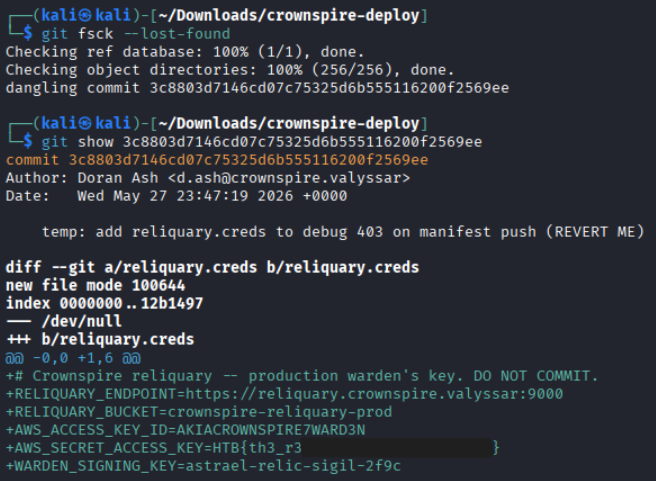

# Force Push
|Category |Difficulty|
|:-------:|:--------:|
|Forensics| Very Easy|

**Skills learned:**
* GitHub repo dump analysis

## Description
We pulled a copy of the `crownspire-deploy` repository off a leaked Cinderbound backup. Word is the production warden's key for the reliquary got committed by mistake and then cleaned up before anyone noticed. The current history looks spotless. Recover what they tried to bury.

**File attachment(s):**
```text
a24de668-d492-459a-b81d-6759925af8bd-1784554618.zip
└── crownspire-deploy
    ├── .git
    ├── .github
    ├── crownspire
    ├── docs
    ├── examples
    ├── scripts
    └── ... (more files included)
```

## Searching Code Files for Clues
This is a dumped GitHub repository, so I began searching the code files for possible clues on where to find the flag.

Inside the file **/tests/test_config.py** we find a clue:
```
FULL_ENV = {
    "RELIQUARY_ENDPOINT": "https://reliquary.crownspire.valyssar:9000",
    "RELIQUARY_BUCKET": "crownspire-reliquary-prod",
    "AWS_ACCESS_KEY_ID": "AKIATEST",
    "AWS_SECRET_ACCESS_KEY": "shhh",
    "WARDEN_SIGNING_KEY": "sigil-key",
}
```

It appears that we may find another clue (if not the flag) under a variable named **WARDEN_SIGNING_KEY**.

## Using Git Commands to Search for Clues
I pivoted to using **git commands** to find other possible clues, starting with `git log -p -S "WARDEN_SIGNING_KEY"` to search for and print the commit history containing the string "WARDEN_SIGNING_KEY".

This, along with any other commit history searches, did not provide any useful findings.

After some time, I changed tactics to then search for unreachable/dangling objects - which are commits, trees or file blobs that are no longer being pointed to. I used the command `git fsck --lost-found`, which found **one dangling commit**.

We can see what that one dangling commit changed using the command `git show [COMMIT HASH]`.



Instead of finding the flag inside the warden's key like I expected, we can find it inside the **AWS_SECRET_ACCESS_KEY** variable found in the dangling commit.

## Flag
**Flag: HTB{th3_r3\*\*\*\*\*\*\*_\*\*\*\*\*_\*\*\*\*\*\*\*}**