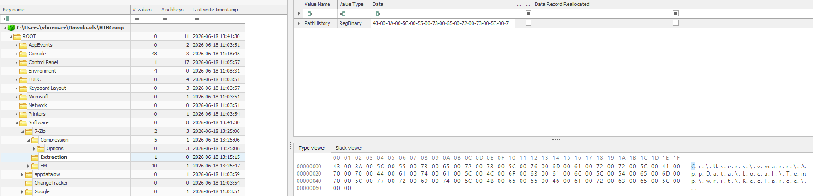
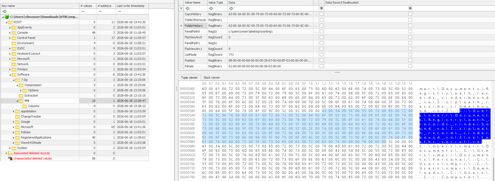
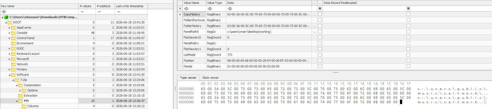
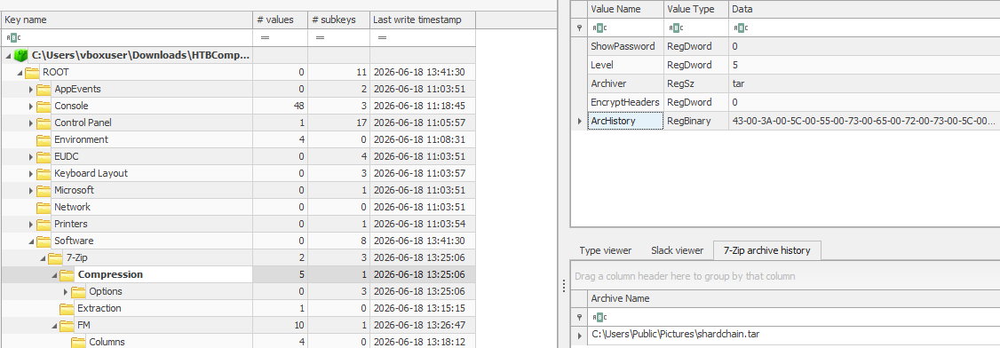
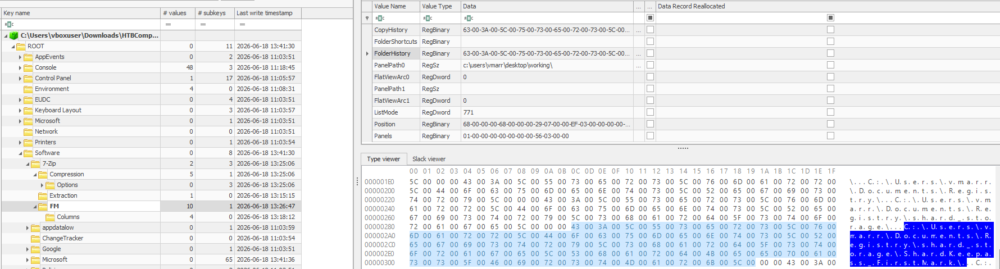
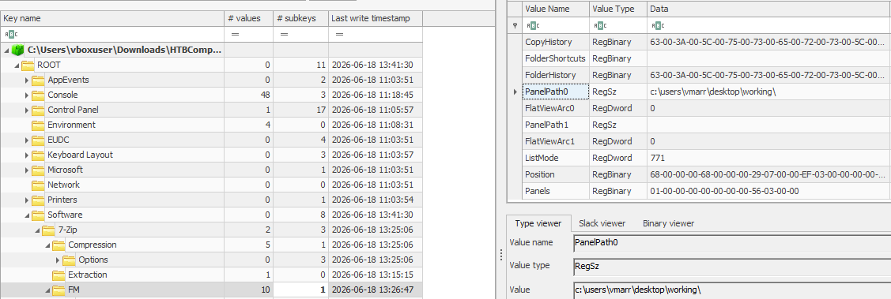

# The Compressed Truth
|Category |Difficulty|
|:-------:|:--------:|
|Forensics| Very Easy|

**Skills learned:**
* Windows Registry Analysis

## Description
ASHVAULT was never the destination. It was the key.

The operational brief recovered from ASHVAULT's search index pointed deeper — to Veylen Marr's inner node, the machine where the Shard Reference custody chains sleep behind his personal credentials. CROWQUILL used what the brief called an unverified password — lifted through a Suncourt intermediary — to authenticate as vmarr and walk through the inner door. No forced entry. No broken locks. Just a stolen name presented at the right threshold, and the machine believed it.

What the operative found inside was worse than Cassian had hoped for. The Shard Reference 7 custody chain was there — a full record of where the Greywater Fragment had moved since the night the Signet shattered, whose hands had touched it, and where it now rested. But CROWQUILL did not stop at documents. They came hunting for something deeper: the master store of secrets that Marr kept locked behind a single password — a vault within the vault, holding the keys to every shard the Registry had ever catalogued. To reach it, the operative brought a specialized tool onto the machine, one built not to break a lock but to lift the key from a hand already holding it.

With the keys in hand and the records copied, CROWQUILL staged everything — compressed it, sealed it, prepared it for a journey through channels that do not ask questions. The source files were wiped. The tools were removed. The operative disconnected before the custody window closed. No wonder Cassian's men moved when they did. The Registry's inner vault had been standing on the assumption that the right credentials made a man trustworthy. It was a comfortable assumption. It was wrong.

The machine has been imaged and handed to you. The files are gone and the archive has left — but the registry remembers the hands that packed it. 7-Zip does not forget which folders were opened, which paths were browsed, and where the staging began. Find the trail. Recover what was taken. Understand what Cassian now holds — and what it means for every shard still in the Registry's keeping.

The archive left. Its shadow stayed.

**File attachment(s):**
```text
A245ade4-851f-4e47-8d4e-be53d1b81cd4-1784201538.zip
└── C
    ├── Users
    │   ├── cyberjunkie
    │   ├── Default
    │   └── vmarr
    └── Windows
        └── System32
            └── config
```

## Initial Steps
We see that there are Windows artifacts present (C:\ folder), so I examined this case on a Windows VM. Each user has NTUSER.DAT files that can be examined further using the Registry Explorer tool developed by [Eric Zimmerman](https://ericzimmerman.github.io/).

We already have two clues:
* A user **vmarr** is involved
* The tool **7-Zip** was used to compress files 

From here, I began examining vmarr's NTUSER.DAT hive.

## Questions
These questions are to be answered during (and help guide) your investigation.

1. CROWQUILL did not break the lock — they took the key while it was still held. A tool was brought for one purpose: extract secrets from memory before they could be put away. What is its name? 

Under the key **Software\7-Zip\Extraction**, we find one value, which points to the path tool used to *extract secrets*: `C:\Users\vmarr\AppData\Local\Temp\writ\KeeFarce\`.



With a quick search, we can find [KeeFarce](https://github.com/denandz/KeeFarce) and confirm that this is used to extract `KeePass 2.x password database information from memory`.

**Answer: KeeFarce**

---

2. The Registry keeps time as faithfully as it keeps names. The moment CROWQUILL's tool first touched the system is preserved in the artifact. When was the tool extracted? (YYYY-MM-DD hh:mm:ss)

The exact timing can be found under the **last write timestamp** of the key. The Last write timestamp of the **Software\7-Zip\Extraction** key is our answer.

**Answer: 2026-06-18 13:15:15**

---

3. One archive file caught the operative's eye during enumeration, its contents inspected before staging began. What is the deepest folder that was enumerated inside the archive file?

7-Zip's File Manager (FM) stores user settings, history & paths under the hive key **Software\7-Zip\FM**. Examining this key further, we see the value **FolderHistory** that lists all folders that were enumerated.

The deepest full path enumerated is: `C:\Users\vmarr\Documents\Registry\oath_records_cinderbound_vol2.zip\oath_records_cinerbound_vol2\saltoaths_secretive\`



**Answer: saltoaths_secretive**

---

4. Before exfiltration comes collection — files pulled from their places and gathered where the operative controls. Where did CROWQUILL stage the stolen records?

7-Zip's File Manager tracks the folder locations where files have been copied to inside the `CopyHistory` value. We can assume this directory is where stolen records are being staged.



**Answer: C:\users\public\music\saltwork**

---

5. The stolen records were compressed and sealed for the journey out — made small enough for channels that do not ask questions. What is the name of the archive prepared for exfiltration?

Now we pivot to the hive key **Software\7-Zip\Compression** to find out more about what archives were created. In the value `ArcHistory`, we can find the full Archive Name.



**Answer: C:\Users\Public\Pictures\shardchain.tar**

---

6. One file above all others — holding keys to every shard, every custodian, every oath. Whoever holds this holds the right to reconstruct authority older than any crown. Where was it stored?

This question is hinting at the password manager KeePass we discovered during task 1. Going back to 7-Zip's File Manager FolderHistory, we can search for any relevant directories.



**Answer: C:\Users\vmarr\Documents\Registry\shard_storage\ShardKeepass_FirstMark\\**

---

7. When staging was complete and the archive sealed, the trail ends in one folder — where enumeration stopped. Where did CROWQUILL conclude their operations while using the 7zip?

7-Zip's File Manager stores the last active directory path in the Registry value `PanelPath0`. Finding this value tells us the folder where enumeration stopped. 



**Answer: c:\users\vmarr\desktop\working\\**
