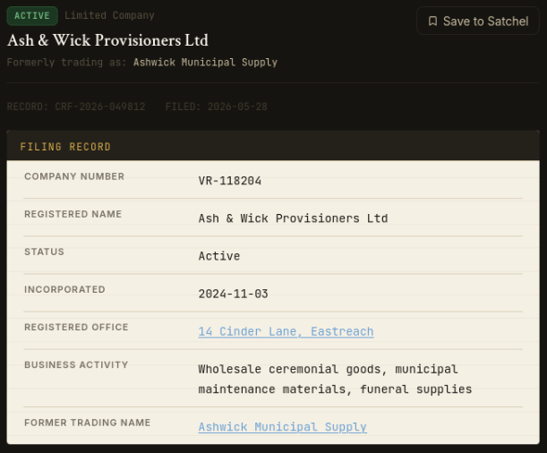
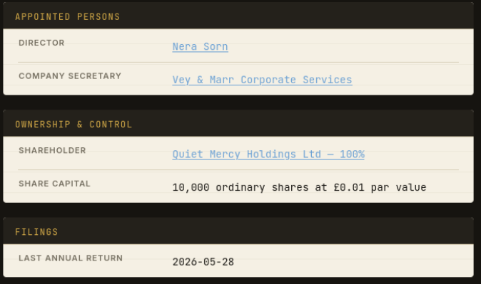
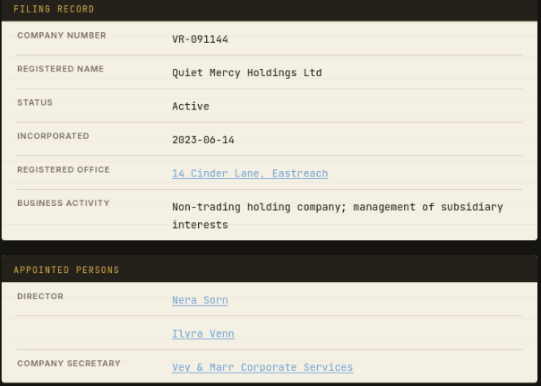
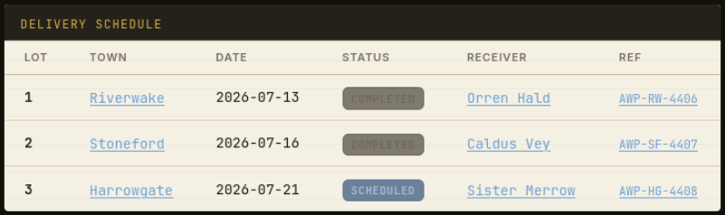

# The Helpers with Clean Hands
|Category |Difficulty|
|:-------:|:--------:|
|  OSINT  |   Easy   |

**Skills learned:**
* Cross-referencing data gathered from multiple sources

## Description
The war of succession has ended on paper, but the Northern Crown Road still bleeds quietly. Villages that once resisted the Crown's claim now receive "mercy" from the Mercy Lantern Relief Trust — a charity delivering burial candles, lamp oil, and grief counselling to communities broken by the fighting. Behind the trust stands Ash & Wick Provisioners Ltd, a wholesale supplier of ceremonial goods whose invoices are clean, whose warehouse is spotless, and whose registered office is a letterbox on Cinder Lane. The charity's trustees believe they serve the grieving. The supplier's director, Nera Sorn, knows otherwise. Above Sorn sits Quiet Mercy Holdings Ltd, a non-trading shell wholly owned by a fiduciary foundation with restricted disclosure — a structure designed so that the same handful of names can sign both the purchase orders and the relief manifests without any single office ever being answerable. The next delivery is scheduled for Harrowgate. The receiving clerk is Sister Merrow. Somewhere in the tender records, the company filings, and the couriered dispatch notes, the chain of control runs from a charity that teaches mercy to a holding company that appoints the hands that make one possible. An intelligence desk has been set up with access to the Companies Register, the Tender Hall, an archive mirror, and the courier's intercepted mail. Trace the structure end to end and file the findings.
Use the Oath Submission form to confirm your findings, then assemble the flag from the verified answers.

*Flag Format: HTB{SUPPLIER_FEEDS_TOWN}*

## Analyst Briefing
"Villages do not fall silent all at once.

First comes the candle-buyer, purchasing more tallow than a winter vigil requires. Then comes the charitable clerk, offering to correct burial rolls. Then comes the supplier with clean invoices — treated cord, lamp oil, mineral binder, and a company address nobody visits.
None of them look like soldiers. That is the point.

The analyst has recovered a procurement reference from a roadside counting room. The tender belongs to **Mercy Lantern Relief Trust**, a charity claiming to provide funeral assistance to villages damaged by the succession war.
Find the company behind **VR-118204**. Do not assume the charity and the supplier are the same legal entity."

## Available Tools & Evidence
```
STARTING EVIDENCE - FIELD RECOVERY

REFERENCE:              ML-22-771
PURCHASER:              Mercy Lantern Relief Trust
SUPPLIER REGISTRATION:  VR-118204
DESCRIPTION:            Winter vigil materials and burial assistance equipment
DELIVERY REGION:        Northern Crown Road
STATUS:                 Awarded
```

## Objectives
1. Identify the commercial company supplying the trust
2. Identify the company that owns 100% of the supplier
3. Identify the director appearing across the supplier and its holding company
4. Identify the next town scheduled to receive a relief delivery
5. Identify the person designated to receive that delivery

## Finding the Flag
To achieve **Objective 1**, I began searching the **Company Register** for the given supplier registration **VR-118204**.



From this, we can see that the **company supplying the trust** is: **Ash & Wick Provisioners Ltd**.

To achieve **Objective 2**, we can continue investigating the **Company Register** for the given supplier registration **VR-118204**.



From this, we can see that the **company that owns 100% of the supplier** is: **Quiet Mercy Holdings Ltd**.

To achieve **Objective 3**, we can investigate the **Director** listed in the **Company Register** for both the supplier company and it's shareholder company.

We have already discovered the supplier company's Director in Objective 2. We can search the **Company Register** for **Quiet Mercy Holdings Ltd** and find who is listed as their Director.



From these, we can see the same director **Nera Sorn** is listed.

To achieve **Objective 4**, we can investigate the **Courier Mail**, looking for references to shipment **ML-22-771**.

```
Dear Sister Merrow,

This is to confirm that Lot 3 of tender ML-22-771 remains scheduled for delivery to Harrowgate on 21 July 2026.

Please confirm that the receiving clerk will sign the goods receipt under the trust name (Mercy Lantern Relief Trust) rather than under the supplier name. N. Sorn has approved the revised release documentation and the updated manifest will accompany the driver.

The delivery reference for your records is AWP-HG-4408. If there are any changes to the receiving location, please notify this office no later than 20 July at noon.

Dispatch Office
Ash & Wick Provisioners Ltd
14 Cinder Lane, Eastreach
```

From this, we can see that the **next town scheduled to receive a relief delivery** is **Harrowgate**.

To achieve **Objective 5**, we can continue investigating the **Courier Mail**, looking for references to shipment **ML-22-771**.

```
Ilyra,

The supplier board has signed off on the trust delivery schedule under ML-22-771. Lots 1 and 2 are confirmed for Riverwake and Stoneford respectively. Harrowgate remains the next uncompleted location and Sister Merrow has been notified as the receiving party.

I have updated the release authorisation. Please ensure the holding company's records reflect the sub-contract arrangement if the foundation queries the structure.

N. Sorn
Director, Ash & Wick Provisioners Ltd
```

From this, we can see that the **person designated to receive that delivery** is **Sister Merrow**.

We can confirm this answer to be true by checking the **Tenders** list and check who is listed as the **Receiver** for **Lot 3**.



## Flag:
Following the flag format *HTB{SUPPLIER_FEEDS_TOWN}*, we need to combine the data obtained while achieving our given objectives. (However the exact flag did take some guessing on my part considering the supplier name contains several words and a special symbol.)

Supplier = Ash & Wick Provisioners Ltd
Town = Harrowgate

**Flag = HTB{ASH_AND_WICK_FEEDS_HARROWGATE}**