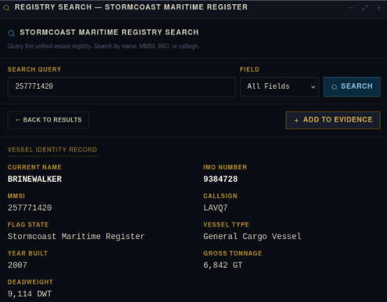
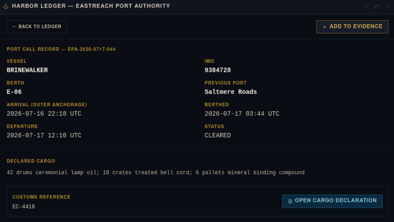

# The Hull Beneath the Name
|Category |Difficulty|
|:-------:|:--------:|
|  OSINT  |   Easy   |

**Skills learned:**
* Using available data sources to extract information

## Description
The Eastreach docks never sleep while the rest of Valyssar argues over crowns. Cargo moves beneath clean seals, harbor clerks stamp manifests they barely read, and Lord Damas Marrowcairn's counting houses insist every shipment is ordinary: lamp oil, funeral cord, mineral pigment, preservation salt. But a frightened dock scribe copied a number before dawn — an MMSI from a grey cargo vessel whose cargo office called her BRINE WALKER while her stern letters looked shorter. The Eastreach cargo seal reads EC-4418, and the vessel was gone by midday. Miren Vale, a freelance maritime investigator, needs to reconstruct the vessel's true identity from the registry and harbor ledger before the trail goes cold. Can you trace the hull beneath the painted name?
Use the Oath Submission terminal to collect and verify your findings, then assemble the flag from the format below.

*Flag format: HTB{VESSELNAME_IMO_BERTH}*

## Analyst Briefing
"The Eastreach docks continue working while the rest of Valyssar argues over kings. Cargo moves beneath clean seals. Harbor clerks approve manifests they barely read. Damas Marrowcairn's counting houses insist that every shipment is ordinary: lamp oil, funeral cord, mineral pigment, preservation salt.

Miren Vale does not begin with an accusation. She begins with a number copied by a frightened dock scribe."

## Available Tools & Evidence
Stormcoast Maritime Register - contains vessel identity records
Harbor Ledger - contains port call records

```
DOCK SCRIBE'S NOTE - EASTREACH OUTER QUAY
"Grey general cargo vessel. Cargo office called her BRINE WALKER, but the stern letters looked shorter. Signal clerk copied MMSI 257771420. Entered before dawn. Eastreach cargo seal EC-4418."
```

## Objectives
1. Identify the vessel's current registered name
2. Recover the vessel's IMO number
3. Determine the EastReach berth where cargo was discharged
4. Confirm the vessel's declared previous port

## Finding the Flag
To achieve **Objectives 1 and 2**, I began searching the **Maritime Register** for the given MMSI number **257771420**.



From this, we can see the following:
* The **vessel's current registered name** is: **BRINEWALKER**.
* The **vessel's IMO number** is: **9384728**.

To achieve **Objectives 3 and 4**, I searched the **Harbor Ledger** for the vessel name **BRINEWALKER**. Only one record existed:



From this, we can see the following:
* The **cargo was discharged** at berth: **E-06**.
* The **vessel's declared previous port** is: **Saltmere Roads**.

## Flag:
Following the flag format *HTB{VESSELNAME_IMO_BERTH}*, we need to combine the data obtained while achieving our given objectives.

Vessel name = BRINEWALKER
IMO = 9384728
Berth = E06

**Flag = HTB{BRINEWALKER_9384728_E06}**