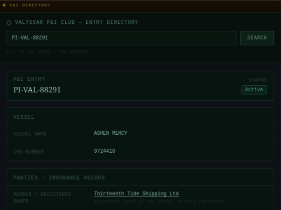
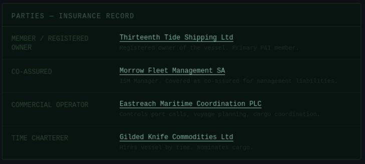
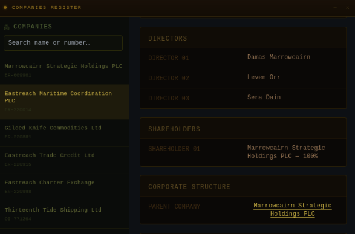
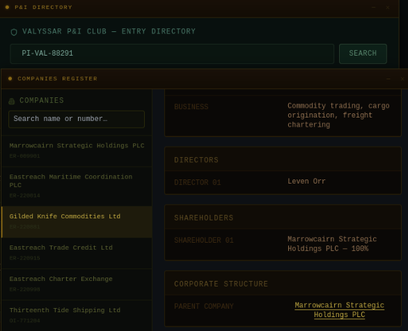

# The Ledger Beneath the Hull
|Category |Difficulty|
|:-------:|:--------:|
|  OSINT  |   Easy   |

**Skills learned:**
* Cross-referencing data gathered from multiple sources

## Description
Lord Damas Marrowcairn does not command fleets — he owns them through a labyrinth of paper. A single cargo vessel, the ASHEN MERCY, sits at the center of a web spun across five companies: a nominee-owned shell that holds the hull, a management firm that runs the machinery, a coordination house that directs the voyages, and a commodities trader that fills the holds. Each layer is clean. Each layer is someone else's name. But every thread, if pulled hard enough, runs back to the same hand. The Outer Isles P&I Club has opened its registry for inspection — registry files, charter fixtures, company ledgers, and P&I entries are all available to those who know where to look. Reconstruct the full ownership chain. Prove that the hand beneath the ink belongs to MarrowcairnUse the Oath Submission form to confirm your findings, then assemble the flag from the verified answers.

*Flag Format: HTB{ITEM_WAS_SHARED_AMONG_QUANTITY_TARGETS}*

## Analyst Briefing
"A ship may have one name painted on its hull and five companies standing behind it.

The registered owner owns the asset. The ISM manager keeps it compliant. The commercial operator chooses where it works. The charterer chooses what it carries, Eastreach survives by ensuring those distinctions remain boring enough that nobody compares them."

## Objectives
1. Identify the vessel's registered owner
2. Identify the ISM manager
3. Identify the commercial operator
4. Identify the time charterer
5. Identify the ultimate controlling company behind the operator

## Available Tools & Evidence
```
STARTING EVIDENCE - CARGO RELEASE CR-EA-71984 **NEED TO VCONFIRM THIS ON THE OFFICIAL WRITEUP

VESSEL IMO:         9724418
P&I ENTRY:          PI-VAL-88291
RELEASE APPROVER:   Eastreach Maritime Coordination PLC
CARGO:              Preservation minerals and treated cord

NOTE: "The approving company is not listed as the vessel owner."
```

## Finding the Flag
To achieve **Objective 1**, I began searching the **P&I Directory** for the provided entry **PI-VAL-88291**.



From this, we can see that the **vessel's registered owner** is **Thirteenth Tide Shipping Ltd**.

To achieve **Objectives 2, 3 and 4**, we can continue investigating the **P&I Directory** for the provided entry **PI-VAL-88291**.



From this, we can see the following:
* The **ISM manager** is: **Morrow Fleet Management SA**
* The **commercial operator** is: **Eastreach Maritime Coordination PLC**
* The **time charterer** is: **Gilded Knife Commodities Ltd**

To achieve **Objective 5**, we need to search the **Companies Register** for the discovered commerical operator and time charterer.





From this, we can see that **Eastreach Maritime Coordination PLC** and **Gilded Knife Commodities Ltd** have the parent company: **Marrowcairn Strategic Holdings PLC**

## Flag:
To get the flag for this challenge, we need to enter our answers in the **Oath Submission form**. We will be indirectly given the flag after all correct answers have been provided:
```
CASE CLOSED
"The hull belongs to a paper company. The machinery answers to a manager. The voyages answer to Eastreach. Beneath every layer sits the same hand, clean because the ink has been divided among five names."
```

Following the flag format *HTB{ITEM_WAS_SHARED_AMONG_QUANTITY_TARGETS}*, we can see a similarly formatted string in our 'case closed' message.

**HTB{THE_INK_WAS_DIVIDED_AMONG_FIVE_NAMES}**