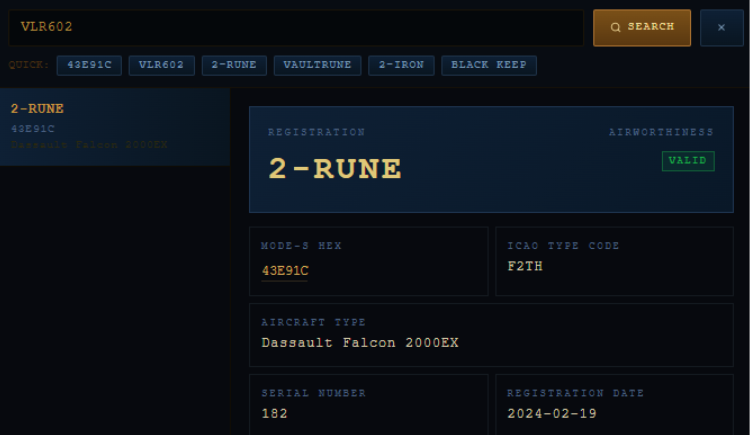
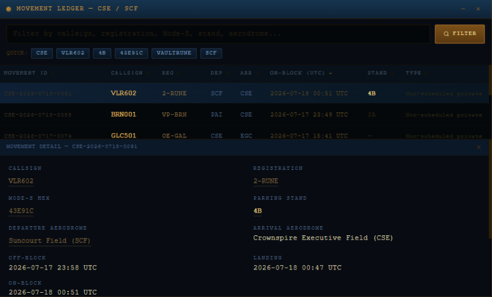

# The Raven that Landed Twice
|Category |Difficulty|
|:-------:|:--------:|
|  OSINT  | Very Easy|

**Skills learned:**
* Using available data sources to extract information

## Description
Suncourt keeps its messengers arriving without looking like messengers — a private aircraft leaves records no one thinks to compare. On the night before three Registry witnesses changed their testimony, a dark executive aircraft slipped into Crownspire Executive Field under a sealed passenger list. But the dispatch slip and fuel sheet were not sealed: a gate clerk copied the aircraft's Mode-S hex 43E91C and its callsign VLR602. Miren Vale, the Aerial Witness Desk's analyst, suspects the same flight was recorded twice — once in the sky under its callsign, once on the
ground under its registration — to hide who truly operated it. The passenger manifest is sealed under Court Courtesy Order CCO-2026-0441, but the technical identifiers remain open. Can you cross-reference the Aircraft Registry, Movement Ledger, Courier Mail, and Skyglass Browser to prove the raven that landed twice was a single aircraft, and expose the operator hiding behind a leasing company's name? Use the Oath Submission app to confirm your findings, then submit the flag in the following format: *HTB{REGISTRATION_FROM_DEPARTURE_AERODROME_TO_PARKING_STAND}*

## Analyst Briefing
"At 00:51 the southern gate received a sealed passenger carriage from Crownspire Executive Field. Dispatch slip referenced **VLR602**. Airfield technician wrote **43E91C** beside the fuel total. Aircraft parked at a private stand."

|Mode-S Hex |Flight Callsign|
|:---------:|:-------------:|
|  43E91C   |    VLR602     |

## Objectives
1. Identify the aircraft registration
2. Identify the aircraft operator
3. Identify the departure aerodome
4. Identify the parking stand used at Crownspire

## Available Tools & Data
Aircraft Registry - contains details about each aircraft
Movement Ledger - contains aircraft flight record data
Courier Mail - contains courier messages
Skyglass Browser - limited web browser
Evidence Satchel - holds data tagged as evidence
Oath Submission - used to confirm correctness of answers gathered

## Finding the Flag
To achieve **Objective 1**, I began searching the **Aircraft Registry** for any data on flight **VLR602**.

From this, we can see that the **aircraft registration** is: **2-RUNE**.

To achieve **Objectives 3 and 4**, I searched the **Movement Ledger** for flight **VLR602**.

From this, we can see that the **departure aerodome** is: **Suncourt Field** and that the **parking stand** is: **4B**.

Now we already have all the information needed to obtain the full challenge flag. No extra digging is needed for **Objective 2**.

## Flag:
Following the flag format *HTB{REGISTRATION_FROM_DEPARTURE_AERODROME_TO_PARKING_STAND}*, we need to combine the data obtained while achieving our given objectives.

Registration = 2-RUNE
Departure_aerodome = Suncourt Field
Parking_stand = 4B

**Flag = HTB{2-RUNE_FROM_SUNCOURT_FIELD_TO_4B}**